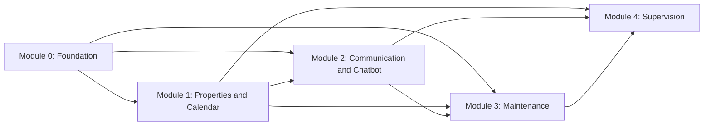

# Module Decomposition

**Status:** Accepted product boundaries; team allocation remains adjustable

## Decomposition Principles

- A module owns a coherent business responsibility.
- Cross-module data access occurs through documented services or APIs.
- Shared foundation code remains small and intentional.
- Module ownership does not remove the need for team review.
- Frontend screens follow business modules rather than becoming a separate undocumented architecture.

## Module 0: Platform Foundation

### Responsibilities

- Application configuration
- Company tenancy
- Users, authentication, and authorization
- Database connection and migrations
- Shared API errors and pagination
- Audit conventions
- Docker development stack
- Deployment and observability baseline

### Primary entities

`Company`, `AppUser`

### Dependencies

PostgreSQL, FastAPI, SQLAlchemy, Alembic

## Module 1: Properties and Calendar

### Responsibilities

- Property records and operational knowledge
- Booking-channel configuration
- Calendar-feed synchronization
- Booking and blocked-period normalization
- Manual bookings
- Availability calculation
- Conflict detection
- Portfolio calendar and conflict views

### Primary entities

`Property`, `Channel`, `Booking`, `CalendarSyncRun`, `BookingConflict`

### Exposed services

- Property lookup
- Availability check
- Booking search
- Conflict query

## Module 2: Guest Communication and Chatbot

### Responsibilities

- WhatsApp webhook ingestion
- Conversation resolution
- Message persistence and delivery status
- Language and intent classification
- Property-grounded answers
- Availability-tool use
- Escalation
- Human takeover
- Maintenance-ticket suggestions

### Primary entities

`Conversation`, `Message`, optional structured `ActionSuggestion`

### Dependencies

Property lookup, availability service, WhatsApp provider, AI model provider

## Module 3: Maintenance Operations

### Responsibilities

- Ticket creation
- Priority and lifecycle
- Contractor contact directory
- Manual assignment
- Assignment history
- Guest update preparation or sending
- Maintenance board and filters

### Primary entities

`Ticket`, `Contractor`, `TicketAssignment`, optional `TicketStatusHistory`

### Dependencies

Property and optional booking context, conversation/message service

## Module 4: Supervision and Settings

### Responsibilities

- Attention-focused dashboard
- Daily arrivals and departures
- Conflict, escalation, and urgent-ticket alerts
- Company settings
- Team management interface
- Integration-health visibility

### Primary data

Read models or queries derived from Modules 0-3

## Dependency Direction

## Suggested Team Allocation

This is a planning proposal, not a permanent ownership rule.

| Member focus | Lead responsibilities | Support responsibilities |
|---|---|---|
| Platform lead | Module 0, deployment, shared backend standards | Review tenancy and security across modules |
| Calendar lead | Module 1 end to end | Shared frontend components and dashboard calendar data |
| Guest-operations lead | Module 2, then Module 3 with team support | AI evaluation and WhatsApp integration |

Module 3 should be shared if Module 2 integration work becomes heavy. Module 4 should be assembled collaboratively after the source modules expose stable data.

## Recommended Delivery Order

1. Foundation contracts and first migration
2. Authentication and company isolation
3. Property CRUD and knowledge
4. Manual bookings and availability
5. iCalendar import and conflicts
6. Conversations and message simulator
7. Chatbot grounding and escalation
8. Maintenance workflow
9. WhatsApp test integration
10. Dashboard and integration polish
