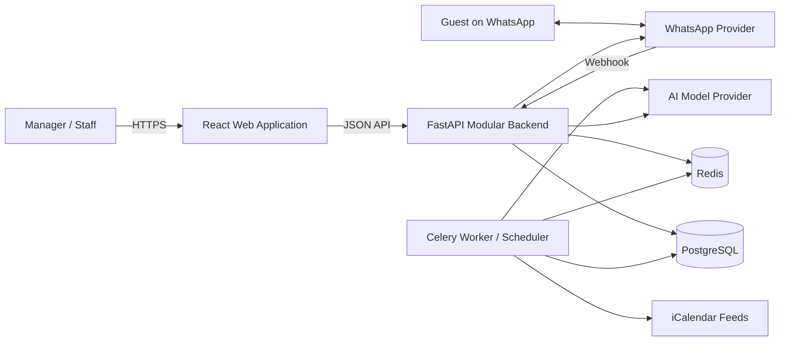

# System Architecture

**Status:** Proposed logical architecture; implementation details may evolve

## Architectural Style

Vayca should begin as a modular monolith rather than a microservice system. A modular monolith is one deployable backend application with explicit internal module boundaries. This approach reduces deployment and debugging overhead for a three-person team while preserving a path to later service extraction if scale justifies it.

The system uses:

- React and TypeScript for the web client;
- FastAPI for HTTP APIs and webhook endpoints;
- PostgreSQL for persistent relational data;
- SQLAlchemy for persistence mapping;
- Alembic for version-controlled schema migrations [REF-ALEMBIC];
- Redis and Celery for scheduled and asynchronous work;
- an AI model provider for chatbot generation and classification;
- WhatsApp Cloud API or a provider-compatible adapter for messaging;
- iCalendar feeds for initial calendar interoperability.

## Container-Level View



## Backend Layers

### API layer

- HTTP routing
- Request validation
- Authentication dependencies
- Authorization checks
- Response schemas
- Webhook acknowledgement

### Application layer

- Use-case orchestration
- Transaction boundaries
- Cross-module coordination
- Background-job dispatch
- Chatbot action policy

### Domain layer

- Availability rules
- Booking-overlap logic
- Ticket lifecycle rules
- Conversation state
- Roles and permissions

### Infrastructure layer

- SQLAlchemy repositories
- External provider adapters
- Celery tasks
- Logging
- Configuration

## Suggested Backend Structure

```text
backend/app/
|-- main.py
|-- core/
|   |-- config.py
|   |-- database.py
|   |-- security.py
|   `-- errors.py
|-- modules/
|   |-- identity/
|   |-- properties/
|   |-- calendar/
|   |-- messaging/
|   |-- chatbot/
|   |-- maintenance/
|   `-- dashboard/
|-- integrations/
|   |-- ical/
|   |-- whatsapp/
|   `-- ai/
|-- workers/
|-- migrations/
`-- tests/
```

This is guidance for discussion. The database lead may refine names while preserving module ownership and dependency direction.

## Frontend Architecture

The frontend should mirror user workflows:

```text
frontend/src/
|-- app/
|-- components/
|-- features/
|   |-- auth/
|   |-- dashboard/
|   |-- calendar/
|   |-- messages/
|   |-- maintenance/
|   |-- properties/
|   `-- settings/
|-- services/
|-- types/
`-- styles/
```

Recommended user-facing navigation:

1. Dashboard
2. Calendar
3. Messages
4. Maintenance
5. Properties
6. Settings

Property details and conversation threads are drill-down routes, not main navigation destinations.

## Authentication Architecture

The proposed MVP uses email/password authentication with:

- password hashing through `pwdlib` and Argon2;
- signed JWT access tokens through `PyJWT`;
- FastAPI security dependencies;
- manager and staff role checks;
- company context resolved for every authenticated request.

FastAPI's official security guidance demonstrates OAuth2 password flow, `PyJWT`, and secure password hashing [REF-FASTAPI-SECURITY]. The exact refresh-token or secure-cookie strategy should be selected during implementation and documented before deployment.

## Multi-Tenant Request Rule

For every authenticated operation:

1. Decode and verify the authentication credential.
2. Load the active user.
3. Resolve `company_id` and role from trusted database state.
4. Apply role authorization.
5. Restrict every tenant-owned query to that company.
6. Record actor identity for sensitive changes.

Client-supplied `company_id` must never be trusted as authorization.

## Background Processing

Background jobs are appropriate for:

- scheduled calendar-feed refresh;
- feed parsing and conflict checks;
- chatbot processing when webhook acknowledgement must remain fast;
- outgoing message retry;
- integration-health checks;
- future reporting.

Jobs must be idempotent because task systems and webhooks may retry delivery.

## API Contract Principles

- Use versioned API routes such as `/api/v1`.
- Use consistent Pydantic request and response schemas.
- Use one documented error shape.
- Distinguish `401 Unauthorized` from `403 Forbidden` correctly.
- Provide pagination for growing lists.
- Return machine-readable status values and user-friendly UI labels separately.
- Generate OpenAPI documentation for frontend alignment.

## Deployment Environments

| Environment | Purpose | Data |
|---|---|---|
| Development | Local feature work | Local/mock/test data |
| Test/CI | Automated verification | Disposable database |
| Staging | Integrated demonstration | Controlled non-production data |
| Production/pilot | Real customer pilot | Protected real data |

The internship may use development and staging first, but configuration should not assume only one environment.
