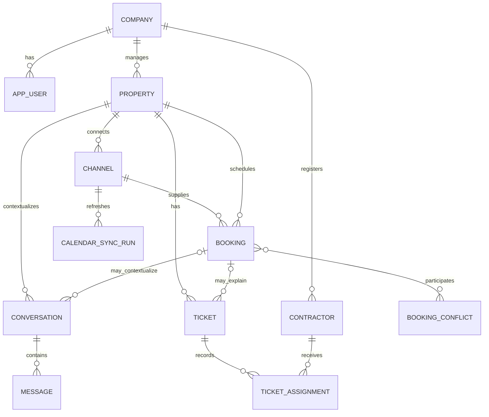

# Data Conception

**Status:** Provisional domain model; initial schema baseline implemented, final DDL and workflow semantics remain subject to team review

## Modeling Goals

- Represent one or many properties under a company account.
- Preserve booking, conversation, and maintenance history.
- Support reliable external-event synchronization.
- Enforce tenant isolation and key integrity.
- Provide auditable chatbot and staff actions.
- Avoid unnecessary marketplace, payment, guest-account, or contractor-login entities.

## Conceptual Model

## Candidate Entities

### Company

Represents an agency or independent-owner workspace.

Candidate fields:

- `id`
- `name`
- `status`
- `timezone`
- `default_currency`
- `created_at`, `updated_at`

### AppUser

Represents a manager or staff member.

Candidate fields:

- `id`, `company_id`
- `name`, `email`
- `password_hash`
- `role`: manager or staff
- `status`
- `last_login_at`
- audit timestamps

The accepted MVP baseline uses globally unique app-user email addresses, as
recorded in `docs/decisions/0001-initial-database-schema.md`. This simplifies
login because a user does not need to select a company before authentication.
If one person must later belong to several companies, the team will review this
choice and introduce the required account-membership migration.

### Property

Represents one managed accommodation.

Candidate fields:

- `id`, `company_id`
- name and address fields
- city and timezone
- capacity and operational status
- check-in/out information
- Wi-Fi, parking, amenities, house rules, emergency contact
- external booking link
- archived timestamp
- audit timestamps

Sensitive operational fields require authorization and careful chatbot exposure.

### Channel

Represents one property connection to one booking source.

Candidate fields:

- `id`, `property_id`
- platform or source type
- external listing identifier
- calendar URL or encrypted integration reference
- active state
- last successful synchronization time
- last error summary

### Booking

Represents an imported or manually created reservation/block.

Candidate fields:

- `id`, `property_id`
- nullable `channel_id` for direct/manual records
- source type
- external event identifier
- guest name and contact when available
- check-in and check-out timestamps/dates
- status
- record type: reservation or blocked period
- last external update time
- audit timestamps

Candidate integrity rules:

- check-out must be after check-in;
- external identity should be unique within a channel;
- cancelled records do not count as occupied;
- adjacent stays are not overlaps when one checkout equals the next check-in;
- external payload may be stored in a controlled JSON field for troubleshooting, with retention review.

### CalendarSyncRun

Records synchronization observability:

- channel
- start and completion time
- status
- created, updated, cancelled, and rejected event counts
- sanitized error information
- correlation identifier

### BookingConflict

Represents detected overlap state rather than only a transient notification.

Candidate fields:

- property
- participating bookings, through association rows if needed
- detected time
- status: open, acknowledged, resolved, dismissed
- resolution note
- actor and resolution time

### Conversation

Represents one guest communication context.

Candidate fields:

- `id`, `company_id`, `property_id`
- optional active/relevant `booking_id`
- guest contact identifier
- status
- handling mode: automatic or manual
- assigned staff user, optional
- last message time
- audit timestamps

Conversation identity needs testing. A practical MVP rule is one open conversation per company, property, and guest contact, with optional booking context.

### Message

Candidate fields:

- `id`, `conversation_id`
- external provider/message identifier
- direction: inbound or outbound
- sender type: guest, chatbot, staff, system
- sender user ID where applicable
- language
- content
- delivery status
- automatic-send flag
- model/configuration reference where applicable
- confidence/escalation reason where applicable
- provider timestamps and local audit timestamps

### Contractor

Represents a contact, not an authenticated user.

Candidate fields:

- `id`, `company_id`
- name
- phone
- specialty
- notes
- active state
- audit timestamps

### Ticket

Candidate fields:

- `id`, `company_id`, `property_id`
- optional `booking_id` and `conversation_id`
- title and description
- category and priority
- status
- created by user
- suggested by chatbot flag/reference
- resolved time
- audit timestamps

### TicketAssignment

Preserves assignment history:

- ticket and contractor
- assigned by user
- assigned time
- ended/reassigned time
- notes

## Tenant-Isolation Strategy

The accepted MVP baseline stores `company_id` on every tenant-owned table and
includes it in composite foreign keys between tenant-owned records, as recorded
in `docs/decisions/0001-initial-database-schema.md`. This makes tenant filtering
explicit and lets PostgreSQL reject relationships that cross company boundaries.

Application repositories and services must still derive the company from the
authenticated server-side context and scope every query by that company. The
database constraints provide defense in depth; they do not replace application
authorization. Cross-company persistence tests are required before dependent
feature modules are considered complete.

## Data Lifecycle

- Prefer archive/deactivation over deleting operational history.
- Define retention for guest contacts, message content, external payloads, and logs.
- Provide correction and deletion procedures where legally required.
- Do not place secrets or access codes in logs.
- Back up production/pilot data and verify restore.

## Migration Strategy

The first migration should create only approved entities and constraints. Every later schema change should use a reviewed Alembic migration. Autogenerated migrations must be inspected before execution because generation does not replace domain review [REF-ALEMBIC].

## Database Review Checklist

- [x] Final entity names approved for the initial MVP baseline
- [x] Tenant-isolation strategy approved
- [x] Email uniqueness decision approved
- [x] Booking date and timezone semantics approved
- [x] iCalendar cancellation policy approved
- [x] Conversation identity rule approved
- [x] Ticket status transitions approved
- [x] Unique constraints and indexes identified
- [x] Audit fields consistent for the initial MVP baseline
- [ ] Sensitive-data and retention policy documented
- [x] Initial migration upgrade, downgrade, and re-upgrade run against clean PostgreSQL
- [x] Cross-company foreign-key and booking date-range integrity checks pass
