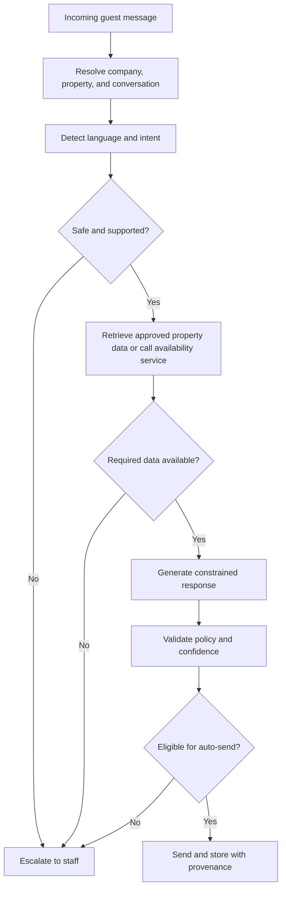

# Chatbot and Integration Conception

**Status:** Proposed safety and integration baseline

## Chatbot Role

The Vayca chatbot is a controlled communication capability, not an autonomous property manager. It may retrieve verified information, generate multilingual replies, classify requests, and suggest structured actions. It must not independently cancel bookings, resolve conflicts, assign contractors, approve refunds, or create high-impact operational changes.

## Supported MVP Languages

- French
- English
- Arabic

Evaluation should include Modern Standard Arabic and representative Tunisian Arabic expressions. Broad model language support is not accepted as proof of local quality.

## Response Policy

### Automatic-answer category

- Wi-Fi details
- check-in and checkout times
- directions and parking
- amenities
- house rules
- approved emergency contact information
- availability obtained from the backend
- owner-configured external booking link

### Human-confirmation category

- proposed maintenance ticket
- proposed priority or issue category
- guest update after ticket change
- ambiguous special request

### Mandatory-escalation category

- refund or payment dispute
- booking cancellation or date modification
- complaint
- emergency or safety issue
- booking conflict
- missing or contradictory property information
- low-confidence interpretation
- unsupported language or provider failure

## Grounded-Answer Flow



## Tool Boundary

The chatbot may request backend tools with structured input. The backend owns execution and authorization.

Candidate tools:

- `get_property_information(property_id, fields)`
- `check_availability(property_id, check_in, check_out)`
- `get_booking_context(conversation_id)`
- `suggest_ticket(conversation_id, category, priority, description)`

The `suggest_ticket` tool creates a suggestion, not a real ticket. Staff confirmation calls the normal ticket-creation use case.

## Prompt and Model Strategy

- Keep model/provider selection configurable.
- Use a system policy that defines allowed, confirmation, and escalation actions.
- Provide only the minimum authorized property context.
- Separate deterministic backend results from generated natural language.
- Store model/configuration version for audit where feasible.
- Never include credentials or unrelated company data in prompts.
- Use evaluation results to compare quality, latency, and cost.

OpenAI's Evals API supports repeatable evaluation datasets and graders; the project may use it or an equivalent local evaluation harness [REF-OPENAI-EVALS].

## Calendar Integration

### iCalendar baseline

RFC 5545 defines a data format for exchanging calendar information independent of a particular calendar service [REF-IETF-ICAL]. Vayca's initial integration should treat iCalendar as an imported availability source, not promise unrestricted official API functionality.

### Synchronization behavior

1. Manager adds a feed to a property channel.
2. System validates and stores the configuration securely.
3. Scheduled worker downloads the feed.
4. Parser normalizes supported events.
5. Upsert logic creates, updates, or cancels records idempotently.
6. Conflict detection runs for changed active periods.
7. Synchronization health is recorded and shown.

### Limitations to communicate

- Feed freshness depends on polling and source behavior.
- iCalendar may not include complete guest, pricing, or reservation metadata.
- Importing availability is not equivalent to official two-way channel management.
- Vayca does not automatically alter source-platform reservations in the MVP.

## WhatsApp Integration

### Development modes

| Mode | Purpose |
|---|---|
| Simulator | Deterministic local and CI testing |
| Provider test | Real webhook and message-delivery verification using test credentials/number |
| Production/pilot | Approved business account and real guest data |

### Webhook requirements

- Verify provider authenticity according to provider documentation.
- Acknowledge quickly and defer slow work.
- Deduplicate by external message/event identifier.
- Preserve delivery status changes.
- Avoid logging full sensitive payloads.
- Retry outgoing messages with bounded policy.
- Keep staff handling usable during provider or chatbot outage.

### Implemented local simulator contract

The MVP development simulator accepts a signed event at
`POST /api/v1/integrations/whatsapp/simulator/inbound`. The payload contains a
property ID, guest contact identifier, message content, external message ID,
and optional timestamp/language. It does not accept a company ID; the backend
resolves company context from the stored property. The caller calculates an
HMAC-SHA256 signature over the raw JSON request body using the local simulator
secret and sends it in `X-Vayca-Simulator-Signature`.

The endpoint returns a `202` acknowledgement after idempotent persistence. It
is a development/CI transport only and must not be described as an approved
WhatsApp connection. Provider test and production modes remain separate future
adapters.

### Interactive WhatsApp Web guest simulator & presentation QR code

To enable realistic live demonstrations during academic defenses and jury evaluations without requiring external third-party provider accounts (Twilio / Meta WhatsApp Business), the platform provides an unauthenticated mobile guest simulator (`/simulator/whatsapp`) and workstation QR presentation modal:

1. **Presentation QR Modal (`SimulatorQrModal`):** Accessible via "Démo WhatsApp" in the sticky workstation header, displaying a dynamic vector QR code generated via a zero-dependency ISO/IEC 18004 pure TypeScript engine (`qrCode.ts`). Evaluators scan the code with their smartphone camera to open the simulator directly.
2. **Guest Mobile Interface (`GuestWhatsAppSimulatorPage`):** Replicates WhatsApp Web with green branding (`#075E54`), dynamic villa selection, configurable guest telephone number (persisted in `localStorage`), message bubbles with origin badges (`🤖 IA Vayca` vs `👤 Équipe Vayca`), typing animation, and 1-tap quick prompts (*WiFi*, *Piscine*, *Check-out*, *Panne Clim*).
3. **Guarded API Endpoints:** Dedicated endpoints (`/api/v1/integrations/whatsapp/simulator/chat/*`) allow fetching active properties, querying chat message history, and dispatching inbound messages into Celery's `process_chatbot_inbound_message` pipeline. All endpoints are guarded by `check_simulator_mode()`, disabling them automatically when production adapters are configured.

## Ticket Suggestion Example

Guest message:

> Water is leaking under the kitchen sink.

Chatbot result:

```json
{
  "action": "suggest_ticket",
  "category": "plumbing",
  "priority": "medium",
  "description": "Guest reports water leaking under the kitchen sink.",
  "requires_staff_confirmation": true
}
```

The interface shows the suggestion. Staff may change priority, add context, select a contractor, and confirm.

## Evaluation Dataset

The team should maintain versioned examples for:

- common property questions;
- unavailable knowledge;
- available and unavailable date ranges;
- date ambiguity;
- complaints and refunds;
- maintenance descriptions;
- emergencies;
- prompt-injection attempts;
- French, English, Modern Standard Arabic, and Tunisian Arabic;
- messages belonging to the wrong or unknown property.

Metrics should include correctness, groundedness, correct escalation, language appropriateness, latency, and estimated cost.
