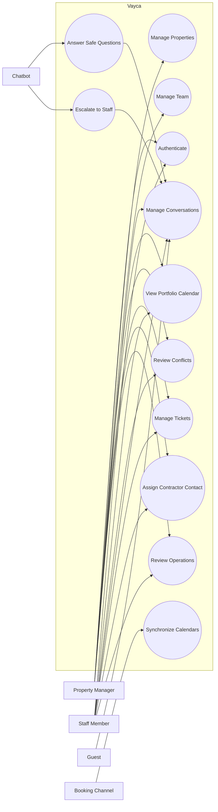
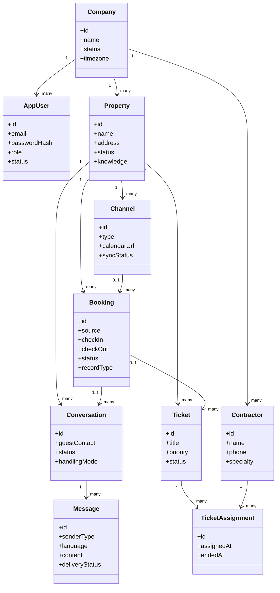
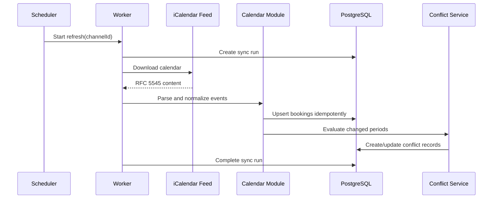
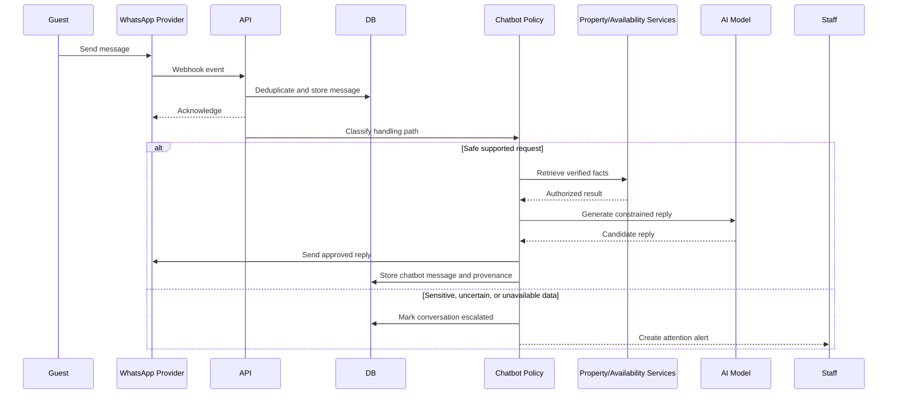
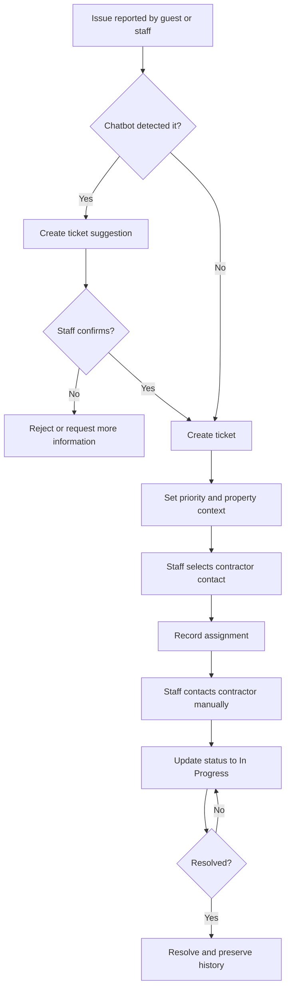
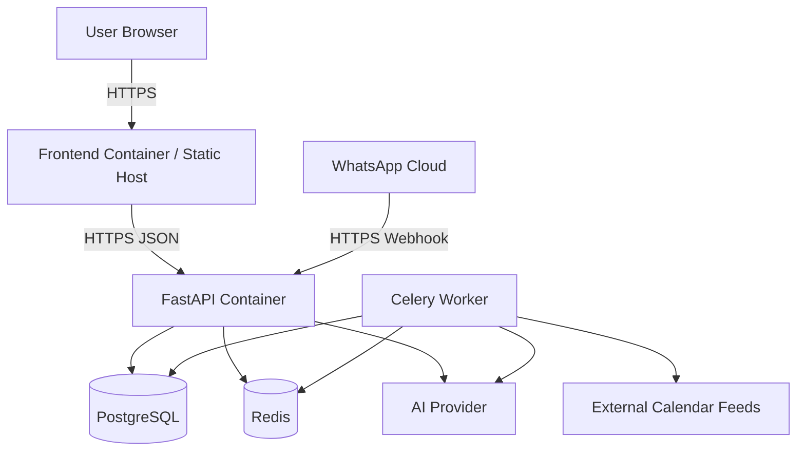

# UML and Workflow Models

**Status:** Editable conception models; diagrams must evolve with approved requirements

## System Use-Case Diagram

The contractor is intentionally absent as a system actor because contractors do not authenticate in the MVP.

## Domain Class Diagram

## Calendar Synchronization Sequence

## Guest Message and Chatbot Sequence

## Maintenance Activity Diagram

## Deployment Diagram

## Diagram Maintenance Rule

When an approved requirement changes an actor, entity, workflow, module dependency, or deployment component, the related diagram must be updated in the same pull request.
