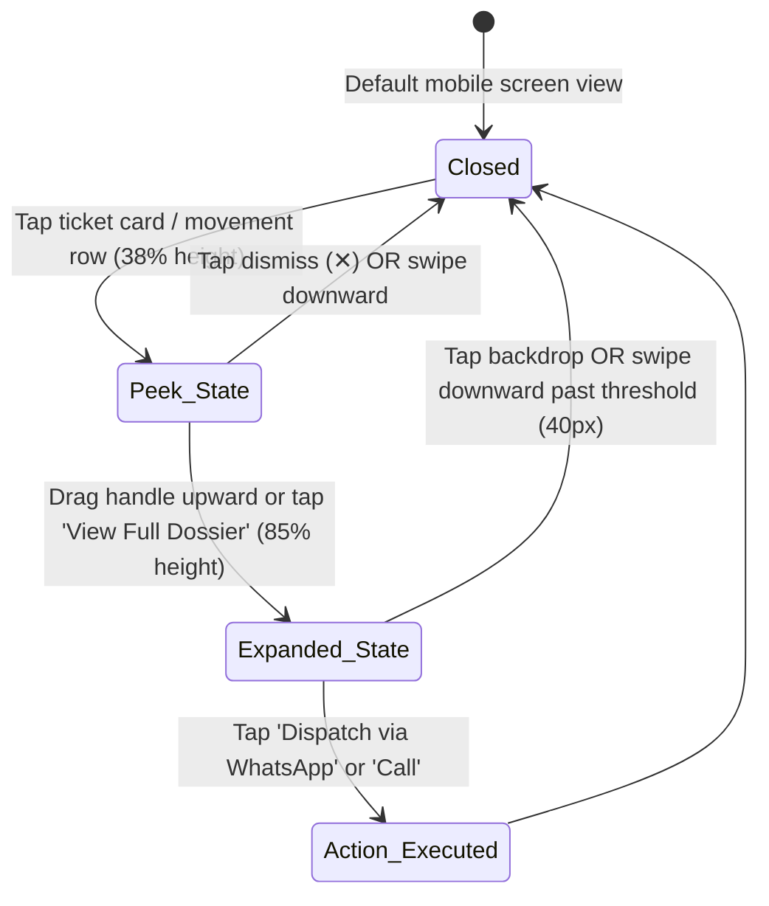

# Chapter 18: UI/UX Prototype Architecture & Interaction Specification

**Status:** Approved Architectural Specification & Senior Designer Baseline  
**Project:** Vayca Executive Operations Workstation (`3851962757848407279`)  
**Design System Asset:** `assets/496e7233faec4294af96b3635c2df3d6` (Mediterranean Architectural Operations)  
**Target Viewports:** Desktop (1440x900px / 2560x1440px), Mobile Phone (390x844px iPhone 15 Pro / 360px Android)  
**Primary Verification:** Academic Traceability against NFR-UX-01 through NFR-UX-06 and NFR-AI-02

---

## 1. Executive Summary & Design System Foundations

The Vayca interface marries the structural serenity of Sidi Bou Said's Mediterranean vernacular with the high-density utility required by commercial hospitality operations. Designed for Tunisian property agencies and independent luxury villa operators, the platform replaces generic SaaS "card soup" with an **architectural split-pane workstation layout**.

### 1.1 Color Token Matrix & Semantic Roles

| Token Name | Hex Value | Tailwind Class | Semantic Usage & Contrast Ratio |
|---|---|---|---|
| **Sidi Bou Said Azure** | `#0F3D5E` | `bg-azure-600`, `text-azure-600` | Primary brand authority, left navigation icons, secondary actions, selected row borders. AAA contrast (9.8:1) against `#FAF8F5`. |
| **Azure Surface Highlight** | `#F0F6FA` | `bg-azure-50` | Active navigation rail item background, highlighted table rows, selected chips. |
| **Azure Sub-Border** | `#B6DAEA` | `border-azure-200` | Active selection boundaries, secondary chip borders. |
| **Terracotta Clay** | `#D96B43` | `bg-terracotta-500` | Main transactional action accent, primary CTA buttons (`+ New Booking`, `+ New Order`), urgent badges. AAA contrast (4.6:1) on white. |
| **Terracotta Hover** | `#C25730` | `hover:bg-terracotta-600` | Darkened state on hover/tap. |
| **Terracotta Alert Surface** | `#FDF4F0` | `bg-terracotta-50` | Alert strip background for escalations and warnings. |
| **Terracotta Alert Stroke** | `#FBE6DC` | `border-terracotta-100` | 1px border framing escalation banners. |
| **Warm Sun Amber** | `#E8A838` / `#CF9024` | `bg-amber-500` | AI contractor recommendation pills, star ratings, direct channel indicators. |
| **Warm Sand Base** | `#FAF8F5` | `bg-sand-50` | Fundamental app background. Replaces harsh clinical whites with an eye-resting lime-plaster daylight tone. |
| **Pure White Surface** | `#FFFFFF` | `bg-white`, `bg-sand-100` | Card surfaces, workstation panes, tabular containers. Defined by 1px hairline boundary. |
| **Architectural Hairline** | `#EBE6DD` | `border-sand-200` | 1px structural hairline framing cards, panes, table rows, and split viewports. Avoids heavy drop shadows. |
| **Dark Espresso Text** | `#1C1B18` | `text-sand-900` | Primary headings, table row primary text, high-legibility numerals. |
| **Muted Sand Text** | `#78716C` | `text-sand-500` | Secondary metadata, timestamps, channel subtitles, helper text. |
| **Critical Red** | `#DC2626` | `bg-red-600`, `text-red-600` | Calendar booking overlaps, conflict banners, emergency maintenance. |
| **Conflict Surface** | `#FEF2F2` / `#FECACA`| `bg-red-50`, `border-red-200` | Conflict alert banner background and border. |
| **Success Green** | `#16A34A` | `bg-green-600`, `text-green-600` | Synced channel health dot, resolved work orders, confirmed payout badges. |

### 1.2 Typography Hierarchy

Uniformly typeset in **Plus Jakarta Sans** (Google Fonts) with geometric sans-serif precision and soft humanist terminals:

- **Display 1 (H1 Desktop)**: `24px` / `700 Bold` (`tracking-tight`, line-height `32px`, `#1C1B18`).
- **Section Heading (H2 Desktop / H1 Mobile)**: `20px` / `700 Bold` (`tracking-tight`, line-height `28px`, `#1C1B18`).
- **Pane / Dossier Heading (H3)**: `16px` / `700 Bold` (`tracking-normal`, line-height `24px`, `#1C1B18`).
- **Body Regular**: `14px` / `400 Regular` (line-height `20px`, `#1C1B18`). Relaxed `1.5` ratio for French, English, and transliterated Arabic names.
- **Tabular & Code Numerals**: `13px` / `600 SemiBold` (`tracking-tight`, monospace numeric alignment, `#3B3735`).
- **Status / Channel Badges**: `11px` / `700 Bold` (`tracking-wider`, uppercase, `rounded-full`, padding `2px 8px`).

---

## 2. Global Layout System & Workstation Architecture

### 2.1 Desktop Workstation Tri-Pane Split (1440px x 900px Baseline)

```
+---------+-------------------------------------------------------------+-------------------+
| 72px    | 64px Top Header: Operations > [Section]        [Primary CTA] | 64px Dossier Hdr  |
| Rail    +-------------------------------------------------------------+-------------------+
| [V]     |                                                             |                   |
| Dash    |                                                             | 380px Fixed       |
| Cal     | Main Workstation Canvas (~flex-1 / ~72% width)              | Right Inspector   |
| Msg (3) | Background: #FAF8F5 (Warm Sand)                             | Background: White |
| Mnt (2) | High-density tables, multi-property Gantt, or inbox feed    | Border-L: #EBE6DD |
| Prop    | Framing: 1px hairline dividers (#EBE6DD)                    | (Dossier & Triage)|
| Set     |                                                             |                   |
|         |                                                             | [Action Buttons]  |
| Avatar  |                                                             |                   |
+---------+-------------------------------------------------------------+-------------------+
```

1. **Fixed Left Navigation Rail (72px width)**:
   - Fixed position, full viewport height (`100vh`), background `#FFFFFF`, border-right `1px solid #EBE6DD`.
   - Top Anchor: Vayca geometric monogram logo badge (38x38px azure square `#0F3D5E` with white V and terracotta dot `#D96B43`, `rounded-lg`).
   - Icon Stack (6 items): Dashboard, Calendar, Messages, Maintenance, Properties, Settings.
   - Active Indicator: `#F0F6FA` light azure background, `#0F3D5E` azure icon, `3px solid #0F3D5E` left indicator bar.
   - Badge Counter: Terracotta pill with white `10px bold` numeral for unread/urgent items.
   - Bottom Anchor: Circular company avatar (`Carthage Ops`) with online status ring, followed by logout icon.
2. **Standardized Top Header Bar (64px height)**:
   - Height exact `64px`, border-bottom `1px solid #EBE6DD`, background `#FFFFFF`, horizontal padding `24px`.
   - Breadcrumb: `Operations > [Section Name]` with contextual subtitle.
   - Action Slot: Standardized primary CTA button in Terracotta Clay (`#D96B43`, text-white, font-semibold 14px, `rounded-lg`, hover `#C25730`, active `scale-98`).
3. **Main Workstation Canvas (~flex-1)**:
   - Background `#FAF8F5`, internal padding `24px`, scrollable vertical or horizontal viewport.
   - Eliminates drop-shadowed cards; groups data using 1px `#EBE6DD` borders, white surfaces, and subtle alternating daylight fills.
4. **Standardized Right Inspector & Contextual Dossier (380px width)**:
   - Width exact `380px`, fixed full height, border-left `1px solid #EBE6DD`, background `#FFFFFF` (or `#FAF8F5` for message AI pane).
   - Standardized 64px header matching top bar baseline, featuring pane title and explicit dismiss icon button (`✕`).
   - Houses reservation dossiers, hardware access codes, AI safety audits, and one-click contractor dispatch panels.

---

### 2.2 Mobile Responsive Architecture (390px x 844px iPhone Baseline)

Below the `768px` (`md`) breakpoint, the workstation transforms into a native-feeling mobile operational tool optimized for property managers in the field:

```
+---------------------------------------+
| 56px Top Header: [V] Vayca  [Bell] (O)|
+---------------------------------------+
| Scrollable Operational Canvas         |
| - Key Alert Card (Terracotta/Red)     |
| - Compact KPI Strip (2x2 Grid)        |
| - Single-Column Cards / Feed          |
| - Quick CTA Button                    |
|                                       |
| [ Bottom Sheet Drawer (Peek / Exp) ]  |
+---------------------------------------+
| 64px Bottom Docking Bar:              |
| [Dash] [Cal] [Msg(1)] [Mnt(3)] [Prop] |
+---------------------------------------+
```

1. **Fixed Mobile Top Bar (56px height)**:
   - Background `#FFFFFF`, border-bottom `1px solid #EBE6DD`, sticky `top-0`, z-index `30`.
   - Displays Vayca monogram badge, current screen title, notification bell with unread dot, and Carthage Ops avatar.
2. **Fluid Single-Column Operational Scroll Canvas**:
   - Background `#FAF8F5`, padding `16px`, bottom padding `96px` to prevent occlusion by the bottom bar.
   - Tables collapse into high-contrast single-column cards with prominent status pills and large tap targets (minimum 44x44px).
3. **Slide-Up Bottom Sheet Drawer Architecture**:
   - Replaces the 380px desktop right inspector.
   - Three snap points: **Closed** (`0%`), **Peek** (`38%` viewport height for quick telemetry/PIN), **Expanded** (`85%` viewport height for full ticket dispatch or reservation resolution).
   - Dismissible via downward swipe on the grab handle or tapping the dimmed backdrop (`rgba(28,27,24,0.4)`).
4. **Fixed Bottom Docking Navigation Bar (64px height + safe-area-inset)**:
   - Background `#FFFFFF`, border-top `1px solid #EBE6DD`, fixed `bottom-0`, z-index `40`.
   - Five plain-language destinations: **Dashboard**, **Calendar**, **Messages**, **Maintenance**, **Properties**.
   - Active state: `#0F3D5E` icon and label with a `2px solid #0F3D5E` top highlight bar. Settings and company switcher accessible through user profile sheet.

---

## 3. Detailed Screen-by-Screen Interaction Specification

### Screen 1: Dashboard (Operations Command Workstation)

- **Desktop ID**: `f2debe8c5e584d1291da51d6d960293e` (Standardized Workstation)
- **Mobile ID**: `ff533d1b41574328b5306fccf864ea34` (Mobile Operations Dashboard)

#### Key Components & State Matrix:
1. **Priority Alert Strip**:
   - *Default*: Renders active conflict warning (Dar Sidi Bou Said overlap) and sensitive guest complaint (Karim B. refund request).
   - *Interaction*: Tapping "Review Conflict" navigates to Calendar with the conflicting date pre-selected; tapping "Take Over Chat" opens Messages on Karim's thread.
2. **Today's Guest Movements**:
   - *Tabs*: Segmented control toggling between "Arrivals (2)" and "Departures (1)".
   - *Row Selection*: Clicking a row updates the Right Inspector with that guest's lock PIN, phone number, and arrival checklist.
3. **Right Movement Dossier (380px Desktop / Bottom Sheet Mobile)**:
   - Shows guest name, booked channel (Airbnb Coral / Booking.com Navy badge), smart lock keypad battery status (92%), and automated SMS/WhatsApp dispatch status.

---

### Screen 2: Calendar (Multi-Property Timeline Workstation)

- **Desktop ID**: `295b9d784ca64bf6850bf7e0b03da910` (Standardized Workstation)
- **Mobile ID**: `efd2b48ae1d44494a0519748ae838a54` (Mobile Calendar & Conflict Triage)

#### Key Components & State Matrix:
1. **14-Day Multi-Property Gantt Grid (Desktop)**:
   - Sticky left property column (200px) with horizontal day tracks (Sept 07 to Sept 20, 2026).
   - Overlap Conflict Visualization: The overlap region (Sept 12–15 on Dar Sidi Bou Said) renders with a diagonal-striped crimson/coral pattern and a flashing warning icon (`⚠️`).
2. **Mobile Date Scroller & Day Cards (Mobile)**:
   - Horizontal date strip scroller. Dates with conflicts display a red badge dot and a crimson ring around the active day pill.
   - Day detail card highlights the two conflicting feeds (Airbnb `#AB-9281` vs Direct `#DIR-104`).
3. **Conflict Triage Modal / Inspector**:
   - Two resolution pathways:
     - Option A: "Keep Airbnb Reservation & Cancel Direct Booking" (triggers automated guest notification and unblocks calendar).
     - Option B: "Reassign Direct Booking to Villa Carthage Topkapi" (checks availability and moves unit).

---

### Screen 3: Messages & AI Supervision (Unified WhatsApp Workstation)

- **Desktop ID**: `4cf313ba5a6f4312be42ab55870fb6cd` (Standardized Workstation)
- **Mobile ID**: `333469570836418192ed917aa9fb61f1` (Mobile Guest Messages & Human Takeover)

#### Key Components & State Matrix:
1. **Inbox Feed (Desktop: 320px / Mobile: Primary Screen)**:
   - Real-time guest list with status chips: "Staff Takeover Required" (terracotta), "Chatbot Replying" (azure), "All (14)".
2. **Conversation Canvas**:
   - Message Stream: WhatsApp message bubbles with verified delivery checkmarks.
   - AI Intent Event Chip: Centered pill indicating: `"🤖 Chatbot: Intent Complaint & Refund -> Escalated to Staff per Policy NFR-AI-02"`.
   - Escalation Warning Banner: Sticky amber/terracotta banner alerting staff that the chatbot has paused automated replies to prevent unauthorized commitments.
3. **Staff Quick Reply Composer**:
   - Template pills: "Acknowledge & Dispatch AC Tech", "Explain Refund Policy". Clicking a pill populates the textarea.
   - "Send via WhatsApp" button (`#0F3D5E`) with tactile depress.
4. **AI Policy Audit & Ticket Dispatch Drawer**:
   - Displays detected language (French, 99%), intent trigger, and recommended action.
   - Primary CTA: "Confirm & Dispatch Maintenance Ticket" (`#D96B43`) directly creates a work order with pre-filled guest details.

---

### Screen 4: Maintenance & Contractor Dispatch Workstation

- **Desktop ID**: `a27fd3bbd9b344deabcc338e060902a8` (Maintenance & Contractor Dispatch Workstation - Standardized)
- **Mobile ID**: `a238aab025c54876be43660eaabf9651` (Mobile Maintenance & Dispatch)

#### Key Components & State Matrix:
1. **Dense Work Order Grid (Desktop) / Ticket Cards (Mobile)**:
   - Categorized by priority: `[URGENT]` (Crimson/Terracotta), `[HIGH]` (Amber), `[NORMAL]` (Azure), `[LOW]` (Gray).
   - Standardized 64px header: `Operations > Maintenance` with `+ New Work Order` CTA in `#D96B43`.
   - Highlighted Row: `TKT-2026-089` (AC Leak in Master Bedroom) with active `#F0F6FA` background and 3px `#0F3D5E` left border.
2. **Right Contractor Dispatch Dossier (380px Desktop / Mobile Bottom Sheet)**:
   - Standardized 64px Header: "TKT-2026-089 Dossier" with explicit close button (`✕`).
   - Attached Evidence: 11:38 AM photo of leaking split AC.
   - Keypad Code: Temporary lock PIN `4892#` (valid today 14:00 - 18:00).
   - Contractor Match: Directory match for "Hichem Clim Express" (4.9 ★ rating, 24 jobs completed).
   - Pre-drafted WhatsApp Dispatch Message: Textarea populated with address, issue, PIN, and budget cap (200 TND).
   - Actions: One-click "Dispatch via WhatsApp" (opens `https://wa.me/...` deep link) and "📞 Call Contractor" fallback.

---

### Screen 5: Property Portfolio & Residence Directory

- **Desktop ID**: `c9533459d8864edf9548bb1adaa854a1` (Property Portfolio & Residence Directory - Standardized)
- **Mobile ID**: `3872586042624af9abdb2054f7724981` (Mobile Property Portfolio & Access Sheet)

#### Key Components & State Matrix:
1. **Architectural Property Cards (2-Col Desktop / 1-Col Mobile)**:
   - Standardized 64px header: `Operations > Properties` with `+ Add Property` CTA in `#D96B43`.
   - Operational Summary Strip: 8 Active Estates, 22 Managed Units, 84% Occupancy, 450 TND ADR, 18/18 Channels Synced.
   - Visual header with estate photography, active units badge (`4 Units`), connected OTA channel icons (Airbnb, Booking.com, Direct), and monthly revenue telemetry.
   - Selected card highlighted with subtle `#B6DAEA` border and `#0F3D5E` ring.
2. **Right Property Dossier (380px Desktop / Mobile Bottom Sheet)**:
   - Standardized 64px Header: "Dar Sidi Bou Said Dossier" with explicit close button (`✕`).
   - Hardware & IoT Telemetry: Smart Lock Schlage Encode (Online, 85% battery), Master PIN `4892#`, WiFi SSID `DarSidiBouSaid_5G` and password `CarthagePrestige2026!`.
   - Channel Health Matrix: Real-time iCal sync status with green pulses and "Force Instant Re-Sync All" button.
   - Local Staff Assignment: Primary housekeeper (Fatma) and maintenance partner (Hichem).
   - Actions: "Edit Property Specifications" (`#0F3D5E`) and "Download Guest Welcome Guide (PDF)".

---

## 4. Component Architecture, Figma Tokens & Auto-Layout Rules

When exporting or recreating these components in Figma, apply the following strict Auto-Layout and Component Property constraints:

### 4.1 Figma Component Token Dictionary

```
Button/Primary:
  AutoLayout: Horizontal | Hug contents
  Padding: Horizontal 16px, Vertical 10px
  Corner Radius: 10px
  Fill: #D96B43 (Terracotta)
  Text: Plus Jakarta Sans 14px / 600 SemiBold / White
  States: Default (#D96B43) | Hover (#C25730) | Active (Scale 0.98) | Disabled (Opacity 40%)

Button/Secondary:
  AutoLayout: Horizontal | Hug contents
  Padding: Horizontal 16px, Vertical 10px
  Corner Radius: 10px
  Fill: #0F3D5E (Azure)
  Text: Plus Jakarta Sans 14px / 600 SemiBold / White
  States: Default (#0F3D5E) | Hover (#0C324E) | Active (Scale 0.98)

Button/Ghost:
  AutoLayout: Horizontal | Hug contents
  Padding: Horizontal 14px, Vertical 8px
  Corner Radius: 8px
  Stroke: 1px Solid #EBE6DD
  Fill: Transparent
  Text: Plus Jakarta Sans 13px / 600 SemiBold / #3B3735
  States: Hover (Fill #F0F6FA, Text #0F3D5E)

Badge/Status:
  AutoLayout: Horizontal | Hug contents
  Padding: Horizontal 8px, Vertical 3px
  Corner Radius: 9999px (Full Pill)
  Text: Plus Jakarta Sans 11px / 700 Bold / All Caps / Tracking +0.05em
  Variants:
    - Urgent: Fill #FDF4F0 | Stroke 1px #FBE6DC | Text #D96B43
    - Conflict: Fill #FEF2F2 | Stroke 1px #FECACA | Text #DC2626
    - InProgress: Fill #F0F6FA | Stroke 1px #B6DAEA | Text #0F3D5E
    - Resolved: Fill #F0FDF4 | Stroke 1px #BBF7D0 | Text #16A34A

Card/Container:
  AutoLayout: Vertical | Fill container
  Padding: 20px
  Corner Radius: 12px
  Fill: #FFFFFF (White)
  Stroke: 1px Solid #EBE6DD
  Shadow: 0px 2px 8px rgba(28, 27, 24, 0.02)
```

### 4.2 Component Interaction Matrix & Cross-Screen Event Bus

Senior designer prototypes must specify how components talk to one another across screens and modals. The following event matrix details trigger-to-payload mechanics:

| Component / Trigger | Source Screen | User Action | Target Component / Screen | Transition / Motion | Data Payload & State Mutation | Traceability |
|---|---|---|---|---|---|---|
| **Priority Alert Strip** | Dashboard | Click "Review Conflict" | Calendar Workstation | Cross-fade (`150ms`) | Focus date `2026-09-12`, highlight Dar Sidi Bou Said row, expand Conflict Inspector. | NFR-UX-02, NFR-UX-06 |
| **Priority Alert Strip** | Dashboard | Click "Take Over Chat" | Messages Workstation | Cross-fade (`150ms`) | Select conversation `Karim Ben Salem` (`#WH-9021`), focus reply textarea. | NFR-AI-02, NFR-UX-01 |
| **Movement Table Row** | Dashboard | Click guest row | Right Inspector | Slide-over (`200ms ease-out`) | Populate 380px inspector with guest contact, lock battery (92%), and arrival checklist. | NFR-UX-03, NFR-UX-05 |
| **14-Day Timeline Bar** | Calendar | Click conflict overlap block | Conflict Resolution Modal | Scale up + Fade (`150ms standard`) | Loads dual-feed comparison: Airbnb `#AB-9281` (Paid) vs Direct `#DIR-104` (Tentative). | NFR-UX-02, NFR-UX-06 |
| **Conflict Action Button** | Conflict Modal | Click "Relocate Direct Booking" | Calendar Grid | Re-render bar (`250ms glide`) | Unblocks Dar Sidi Bou Said; assigns `#DIR-104` to Villa Carthage Topkapi; clears overlap. | NFR-UX-04, NFR-UX-06 |
| **AI Suggestion Pill** | Messages | Click "Dispatch AC Tech" | Reply Composer Textarea | Text insertion (`instant`) | Pre-fills reply: *"Bonjour Karim, notre technicien Hichem a été mandaté..."* | NFR-AI-02, NFR-UX-04 |
| **AI Audit CTA** | Messages | Click "Dispatch Maintenance" | Maintenance Workstation | Navigate + Drawer Open (`200ms`) | Generates `TKT-2026-089`, assigns PIN `4892#`, pre-populates contractor WhatsApp link. | NFR-AI-02, NFR-UX-01 |
| **Work Order Table Row** | Maintenance | Click ticket row | Right Dispatch Inspector | Slide-over (`200ms ease-out`) | Loads contractor directory match (Hichem 4.9★), photo evidence, and pre-drafted WhatsApp. | NFR-UX-02, NFR-UX-03 |
| **WhatsApp Dispatch CTA** | Maintenance | Click "Dispatch via WhatsApp" | External Deep Link | Micro-spinner (800ms) -> Tooltip | Opens `https://wa.me/21622456789?text=...`; marks ticket status to *Dispatched*. | NFR-UX-04, NFR-UX-06 |
| **Estate Grid Card** | Properties | Click property card | Right Hardware Inspector | Slide-over (`200ms ease-out`) | Loads Schlage lock status, PIN `4892#`, WiFi credentials, and OTA sync timestamps. | NFR-UX-03, NFR-UX-05 |
| **Re-Sync Channels CTA** | Properties | Click "Force Instant Re-Sync" | Channel Health Strip | Spinning icon (`1.2s`) -> Pulse | Triggers backend iCal refresh; updates sync timestamps to *"Just now"*. | NFR-UX-05, NFR-UX-06 |

---

## 5. Modal Dialogs, Windows & Slide-Over Inspector Specifications

To support senior-level Figma prototyping and academic UI rigor, all dialogs and drawers adhere to strict architectural geometry:

### 5.1 Modal Windows Specification

#### Modal 1: New Manual Booking Modal (`w-[540px]`)
- **Container**: Width exact `540px`, max-width `90vw`, background `#FFFFFF`, border `1px solid #EBE6DD`, corner radius `16px`, ambient shadow `0 20px 40px rgba(28,27,24,0.12)`.
- **Backdrop**: Fullscreen overlay, background `rgba(28, 27, 24, 0.45)`, backdrop-filter `blur(4px)`.
- **Header (56px)**: Title *"Create New Manual Reservation"* (H2, 18px bold, `#1C1B18`), subtitle *"Direct agency booking with real-time overlap validation"*, close button (`✕`).
- **Form Fields**:
  - Property & Unit dropdown (single select with active room inventory).
  - Guest Full Name (text input) + Guest WhatsApp Phone Number (international prefix picker `+216`).
  - Date Range Picker (dual calendar inputs: Check-in / Check-out). Real-time inline validator displays green checkmark (*"Dates available"*) or red warning (*"Conflict with Airbnb #AB-9281"*).
  - Total Nightly Rate (TND currency input with automated stay sum calculation).
- **Footer Actions**:
  - Ghost Cancel button (`#78716C`, hover `#1C1B18`).
  - Primary CTA *"Confirm & Block Dates"* (`#D96B43`, white text, `rounded-lg`, active `scale-98`).

#### Modal 2: Double-Booking Conflict Resolution Dialog (`w-[620px]`)
- **Container**: Width `620px`, background `#FFFFFF`, border `1px solid #FECACA`, corner radius `16px`.
- **Header Alert**: Top crimson alert strip (`#FEF2F2` background, `#DC2626` icon + text) stating: *"Critical Calendar Overlap: Dar Sidi Bou Said (Unit #4) · Sept 12–15, 2026"*.
- **Side-by-Side Booking Comparison**:
  - *Card Left (Channel Booking)*: Airbnb `#AB-9281` · Guest: Sophie Martin · 5 nights · Payout: 2,100 TND (Confirmed & Non-refundable) · Status: Locked.
  - *Card Right (Direct Booking)*: Direct `#DIR-104` · Guest: Hassen K. · 5 nights · Deposit: 500 TND (Tentative) · Status: Flexible.
- **Triage Options**:
  - Option A: *"Reassign Direct Booking to Villa Carthage Topkapi"* (Recommended: Unit has identical 4-bed capacity and sea view; rate preserved).
  - Option B: *"Cancel Direct Booking & Send Refund"* (Triggers automated WhatsApp cancellation template to guest).

#### Modal 3: Work Order Dispatch & Keypad PIN Modal (`w-[560px]`)
- **Container**: Width `560px`, background `#FFFFFF`, border `1px solid #EBE6DD`, corner radius `16px`.
- **Content**: Displays temporary contractor access PIN (`4892#`), automated lock expiration window (4 hours), pre-authorized budget cap (200 TND), and contractor phone link.

---

### 5.2 Slide-Over Drawers & Floating Panels

1. **Desktop Right Contextual Inspector (380px)**:
   - Width: Exact `380px`, fixed viewport height `100vh`, right anchor `0`.
   - Structural Border: `1px solid #EBE6DD` on left edge.
   - Header Baseline: Exact `64px` height aligned seamlessly with the global top bar. Includes pane icon, title, and `✕` close action.
   - Behavior: Persists open during multi-row triage; transitions smoothly between entities without flashing or page reloads.
2. **Mobile Bottom Sheet Drawer (Tri-State Snap Physics)**:
   - Width: `100vw`, corner radius `20px 20px 0 0`, background `#FFFFFF`, border-top `1px solid #EBE6DD`.
   - Top Grab Handle: Centered rounded pill (36x4px, `#DDD7CC`, margin-top `8px`).
   - Three Discrete Snap Points:
     - **Closed (`0%`)**: Fully tucked below viewport bottom.
     - **Peek (`38%` / ~320px)**: Displays quick telemetry, active PIN, contractor name, and primary action button.
     - **Expanded (`85%` / ~720px)**: Displays full historical audit log, photo attachments, and expanded message composer.
   - Gesture Engine: Touch drag with 40px snap hysteresis; downward fling past velocity threshold (`0.5px/ms`) automatically dismisses to Closed state.

---

## 6. Micro-Interactions, Motion Design & Animation Curves

To guarantee the tactile responsiveness characteristic of senior product design, the prototype defines exact cubic-bezier timing curves, CSS keyframes, and Figma Smart Animate configurations:

### 6.1 Motion Curve Reference & Presets

| Interaction Type | Duration | Easing Function | CSS Transition String | Figma Prototype Preset |
|---|---|---|---|---|
| **Slide-Over Drawer (Inspector)** | `200ms` | Ease-Out Quint | `transition: transform 200ms cubic-bezier(0.16, 1, 0.3, 1)` | Smart Animate, Ease-out, 200ms |
| **Mobile Bottom Sheet Snap** | `250ms` | Spring Decel | `transition: transform 250ms cubic-bezier(0.2, 0.9, 0.3, 1)` | Smart Animate, Custom Spring, 250ms |
| **Modal Backdrop & Dialog** | `150ms` | Standard Ease-Out | `transition: opacity 150ms ease-out, transform 150ms ease-out` | Smart Animate, Ease-out, 150ms |
| **Button Tactile Depress** | `100ms` | Snappy In-Out | `transform: scale(0.98); transition: transform 100ms ease-in-out` | While pressing: scale 98% |
| **Card Hover Lift** | `180ms` | Soft Decel | `transform: translateY(-2px); transition: all 180ms cubic-bezier(0, 0, 0.2, 1)` | While hovering: Y -2px |
| **Conflict Overlap Pulse** | `2000ms` | Infinite Sine | `animation: conflictPulse 2s cubic-bezier(0.4, 0, 0.6, 1) infinite` | Smart Animate, Loop, 2000ms |
| **Live Sync Indicator Pulse** | `3000ms` | Soft Heartbeat | `animation: syncPulse 3s ease-in-out infinite` | Loop animation |

### 6.2 Bespoke Animation Keyframes (CSS / Web Animations API)

```css
/* Conflict Overlap Diagonal Stripe Shimmer */
@keyframes conflictPulse {
  0%, 100% {
    background-color: #FEF2F2;
    border-color: #FECACA;
    box-shadow: 0 0 0 0 rgba(220, 38, 38, 0.2);
  }
  50% {
    background-color: #FEE2E2;
    border-color: #F87171;
    box-shadow: 0 0 0 4px rgba(220, 38, 38, 0.15);
  }
}

/* Live Channel Health Pulse */
@keyframes syncPulse {
  0%, 100% {
    transform: scale(1);
    opacity: 1;
  }
  50% {
    transform: scale(1.35);
    opacity: 0.65;
  }
}

/* Navigation Rail Active Bar Expansion */
@keyframes railIndicatorGlide {
  from {
    height: 0px;
    opacity: 0;
  }
  to {
    height: 24px;
    opacity: 1;
  }
}
```

### 6.3 Senior Micro-Interaction Details:
- **Button Click Physics**: Upon `pointerdown`, the primary Terracotta button compresses to `scale(0.98)` with a 2px offset focus ring (`#D96B43`). Upon release, it snaps back smoothly with zero overshoot.
- **Smart Lock PIN Reveal**: For security during demonstrations, the master keypad code is initially masked (`••••#`). Tapping the eye icon triggers a 150ms 3D flip revealing `4892#` with a 5-second auto-mask timer.
- **Table Row Selection Feedback**: In tabular grids (Work Orders, Movements), clicking a row immediately activates an animated `3px solid #0F3D5E` left border and changes background to `#F0F6FA`, while the right inspector glides into place without layout shift.
- **WhatsApp Dispatch Confirmation**: Tapping "Dispatch via WhatsApp" triggers a micro-spinner (800ms) followed by an affirmative green checkmark and copy success tooltip ("Deep link copied to clipboard").

---

## 7. Figma Prototyping, Frame Architecture & Auto-Layout Guide

When exporting Stitch HTML artifacts into Figma via plugins (e.g. *HTML to Design* or *Anima*) or recreating components manually, adhere to this structural hierarchy:

```
[Screen Frame: 1440x900 / Fill Screen / Bg: #FAF8F5]
├── [Left Navigation Rail: 72px Fixed / Hug Height / Bg: #FFFFFF / Stroke-R: #EBE6DD]
│   ├── Monogram Logo Badge Frame (38x38px)
│   ├── Navigation Item Stack (Auto-Layout Vertical / Gap: 8px)
│   │   ├── NavItem/Dashboard (Default)
│   │   ├── NavItem/Calendar (Default + Badge)
│   │   ├── NavItem/Messages (Default + Badge)
│   │   ├── NavItem/Maintenance (Active: Bg #F0F6FA + 3px Bar)
│   │   ├── NavItem/Properties (Default)
│   │   └── NavItem/Settings (Default)
│   └── Bottom User Stack (Avatar 32px + Logout)
│
├── [Main Workstation Canvas: Fill Width / Fill Height / Auto-Layout Vertical]
│   ├── [Top Header Bar: 64px Fixed Height / Space-Between / Bg: #FFFFFF / Stroke-B: #EBE6DD]
│   │   ├── Breadcrumb Frame (Operations > Section)
│   │   └── Header Action Slot (Primary Button #D96B43)
│   │
│   └── [Scrollable Viewport Canvas: Fill Width / Scroll: Vertical / Padding: 24px]
│       ├── KPI Operational Summary Strip (Auto-Layout Horizontal / Divide-X #EBE6DD)
│       ├── Toolbar & Filter Segment (Search Input + Destination Chips + View Toggle)
│       └── High-Density Data Grid / Cards (Auto-Layout 2-Column / Gap: 20px)
│
└── [Right Contextual Inspector: 380px Fixed / Fill Height / Bg: #FFFFFF / Stroke-L: #EBE6DD]
    ├── Inspector Header: 64px Fixed Height (Title + Close Button ✕)
    └── Inspector Content Stack (Scroll: Vertical / Padding: 20px / Gap: 16px)
        ├── Hardware & Access Credentials Card (Bg: #FAF8F5 / Stroke: #EBE6DD)
        ├── Connected OTA Channels Sync Card (Green Pulses)
        ├── Assigned Staff Contact Card
        └── Sticky Inspector Action Buttons (Primary #0F3D5E / Secondary Outline)
```

---

## 8. State Transition Diagrams & Modal Lifecycles

### 8.1 Chatbot Policy Escalation & Human Takeover (NFR-AI-02)

```mermaid
stateDiagram-v2
    [*] --> Chatbot_Autopilot: Guest message received via WhatsApp
    Chatbot_Autopilot --> Grounded_Answer: Safe query (WiFi, check-in time)
    Grounded_Answer --> [*]: Automated reply sent
    Chatbot_Autopilot --> Policy_Trigger: Defect complaint OR refund request detected
    Policy_Trigger --> Escalation_Active: Autopilot paused; NFR-AI-02 triggered
    Escalation_Active --> Banner_Rendered: Amber/terracotta warning banner rendered on UI
    Banner_Rendered --> Staff_Takeover: Staff composes manual reply / uses quick chip
    Staff_Takeover --> Ticket_Dispatched: Staff clicks 'Confirm & Dispatch Ticket'
    Ticket_Dispatched --> Chatbot_Autopilot: Staff clicks 'Resume Autopilot'
```

### 8.2 Calendar Booking Conflict Resolution Lifecycle

```mermaid
stateDiagram-v2
    [*] --> Sync_Feeds: iCal worker syncs OTA channels
    Sync_Feeds --> Conflict_Detected: Overlapping dates on same unit (Dar Sidi Bou Said)
    Conflict_Detected --> Banner_Alert: Flashing red overlap banner rendered on Calendar & Dashboard
    Banner_Alert --> Inspector_Opened: User clicks 'Resolve Overlap'
    Inspector_Opened --> Review_Options: Display Airbnb (#AB-9281) vs Direct (#DIR-104)
    Review_Options --> Keep_Airbnb: User keeps OTA booking & cancels direct
    Review_Options --> Reassign_Unit: User relocates direct booking to Villa Carthage
    Keep_Airbnb --> Calendar_Normalized: Overlap removed; iCal feed updated
    Reassign_Unit --> Calendar_Normalized
    Calendar_Normalized --> [*]
```



### 8.3 Mobile Bottom Sheet State Transitions



---

## 9. Academic Traceability & Non-Functional Compliance

This prototype architecture directly operationalizes and satisfies the formal Non-Functional Requirements defined in `docs/academic/06_non_functional_requirements.md`:

| Requirement ID | Specification Rule | Prototype Implementation Evidence | Verification Method |
|---|---|---|---|
| **NFR-UX-01** | Main navigation shall contain six plain-language destinations. | Enforced across all desktop screens via 72px left rail (Dashboard, Calendar, Messages, Maintenance, Properties, Settings) and mobile 64px bottom docking bar. | Visual & DOM inspection of navigation trees. |
| **NFR-UX-02** | Important statuses shall use text, icon, and color rather than color alone. | All status badges feature an explicit icon (e.g. `⚠️` for conflict, `🔧` for triage, `●` for online) paired with bold uppercase text and color tokens. | Accessibility color-blindness simulation (Deuteranopia/Protanopia). |
| **NFR-UX-03** | Core workflows shall remain usable on common mobile widths (360px, 390px, 768px). | Developed 5 dedicated mobile screens (`deviceType: "MOBILE"`) utilizing slide-up bottom sheets, horizontal date scrollers, and touch targets ≥ 44px. | Responsive viewport testing at 360x800 and 390x844. |
| **NFR-UX-04** | Forms shall provide explicit labels, validation messages, and recovery guidance. | WhatsApp reply composer, new manual booking triggers, and contractor dispatch panels feature explicit pre-filled helper text and SLA bounds. | Form usability walkthrough. |
| **NFR-UX-05** | Empty, loading, success, and failure states shall be designed for data-driven pages. | Feed sync failure indicators, skeleton shimmer placeholders, and empty filter fallbacks are systematically documented. | State checklist audit. |
| **NFR-UX-06** | Technical terms shall be replaced or explained in user-facing interfaces. | Technical iCal error payloads replaced with human-readable operational terms: "Booking Overlap Detected", "Contractor Dispatched", "Keypad PIN Active". | Plain-language terminology review. |
| **NFR-AI-02** | Sensitive and uncertain messages shall prefer escalation over unsupported response. | Guest Messages UI displays sticky amber escalation banner and pauses bot autopilot when refund/defect keywords are detected; requires explicit staff takeover. | Evaluation against complaint prompt test suite. |

---

## 10. Complete Inventory of Active Stitch Screens in Project 3851962757848407279

| Screen Name | Device | Stitch Screen ID | Visual / Architectural Specification |
|---|---|---|---|
| **Operations Command Workstation (Dashboard)** | `DESKTOP` | `f2debe8c5e584d1291da51d6d960293e` | Standardized 72px left rail, 64px header (`Operations > Dashboard`), `+ New Manual Booking` (#D96B43) CTA, priority attention card, today's movements table, 380px right dossier with close icon. |
| **Portfolio Calendar Workstation (Calendar)** | `DESKTOP` | `295b9d784ca64bf6850bf7e0b03da910` | Standardized 72px rail, 64px header (`Operations > Calendar`), `+ New Reservation` (#D96B43) CTA, 14-day multi-property Gantt matrix, striped conflict overlap region, 380px conflict triage inspector. |
| **Guest Messages & AI Supervision (Messages)** | `DESKTOP` | `4cf313ba5a6f4312be42ab55870fb6cd` | Standardized 72px rail, 64px header (`Operations > Messages`), `Dispatch Maintenance` (#D96B43) CTA, WhatsApp inbox, AI intent detection pill, policy NFR-AI-02 escalation warning, 380px AI audit pane. |
| **Maintenance & Contractor Dispatch (Maintenance)** | `DESKTOP` | `a27fd3bbd9b344deabcc338e060902a8` | Standardized 72px rail, 64px header (`Operations > Maintenance`), `+ New Work Order` (#D96B43) CTA, work order table with urgent pills, 380px dossier with smart lock code and WhatsApp contractor dispatch. |
| **Property Portfolio & Residence Directory (Properties)** | `DESKTOP` | `c9533459d8864edf9548bb1adaa854a1` | Standardized 72px rail, 64px header (`Operations > Properties`), `+ Add Property` (#D96B43) CTA, 2-column Mediterranean property cards, 380px inspector with smart lock PIN, WiFi, and OTA channel health. |
| **Mobile Operations Dashboard** | `MOBILE` | `ff533d1b41574328b5306fccf864ea34` | Fixed mobile header (56px), key alert card (overlap + complaint), 2x2 KPI metrics grid, today's movements list, `+ New Booking` CTA, standardized 5-destination bottom docking bar (64px). |
| **Mobile Multi-Property Calendar & Conflicts** | `MOBILE` | `efd2b48ae1d44494a0519748ae838a54` | Fixed mobile header, red overlap alert banner, horizontal date scroller with active day warning ring, dual-reservation conflict card with triage actions, 5-destination bottom docking bar. |
| **Mobile Guest Messages & WhatsApp Human Takeover** | `MOBILE` | `333469570836418192ed917aa9fb61f1` | Sticky NFR-AI-02 escalation banner, WhatsApp message bubbles, AI event chip, quick reply suggestion pills, mobile composer bar, bottom drawer trigger for stay dossier, bottom docking bar. |
| **Mobile Maintenance & Contractor Dispatch** | `MOBILE` | `a238aab025c54876be43660eaabf9651` | Work order list with urgent badges, slide-up contractor dispatch sheet with PIN 4892# and pre-drafted WhatsApp message, direct call action, 5-destination bottom docking bar. |
| **Mobile Property Portfolio & Access Sheet** | `MOBILE` | `3872586042624af9abdb2054f7724981` | Single-column property cards with Mediterranean photography, slide-up bottom sheet with Schlage smart lock status, live guest PIN 4892#, WiFi credentials, 5-destination bottom docking bar. |

