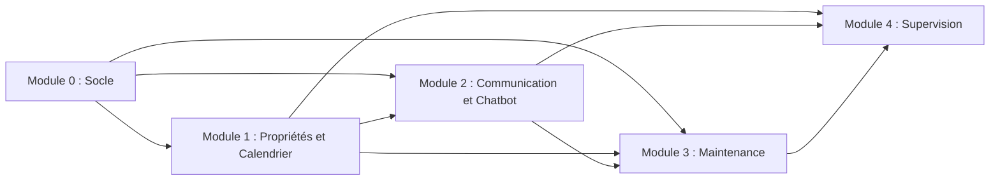

# Chapitre 08 : Décomposition Modulaire

**Statut :** Périmètre produit validé ; l'attribution au sein de l'équipe reste ajustable

## Principes de Décomposition

- Un module assume une responsabilité métier cohérente.
- Les accès aux données inter-modules s'opèrent exclusivement via des services ou des API documentés.
- Le code du socle commun reste restreint et rigoureusement justifié.
- L'attribution d'un module à un responsable n'exclut aucunement la nécessité d'une revue collégiale par l'équipe.
- Les écrans de l'interface utilisateur s'alignent sur les modules métier plutôt que de constituer une architecture parallèle non documentée.

## Module 0 : Socle de la Plateforme

### Responsabilités

- Configuration de l'application
- Gestion du multi-locataire (*company tenancy*)
- Utilisateurs, authentification et autorisations
- Connexion à la base de données et migrations de schéma
- Gestion unifiée des erreurs d'API et pagination
- Conventions de journalisation et d'audit
- Environnement de développement conteneurisé Docker
- Ligne directrice pour le déploiement et l'observabilité

### Entités principales

`Company`, `AppUser`

### Dépendances

PostgreSQL, FastAPI, SQLAlchemy, Alembic

## Module 1 : Propriétés et Calendrier

### Responsabilités

- Fiches des propriétés et référentiel de connaissances opérationnelles
- Configuration des canaux de réservation
- Synchronisation des flux de calendrier
- Normalisation des réservations et des périodes d'indisponibilité bloquées
- Saisie des réservations directes / manuelles
- Calcul dynamique des disponibilités
- Détection automatique des conflits
- Vues du calendrier multi-propriétés et gestion des conflits

### Entités principales

`Property`, `Channel`, `Booking`, `CalendarSyncRun`, `BookingConflict`

### Services exposés

- Consultation de propriété (*Property lookup*)
- Vérification des disponibilités (*Availability check*)
- Recherche de réservations (*Booking search*)
- Consultation des conflits (*Conflict query*)

## Module 2 : Communication Voyageurs et Agent Conversationnel

### Responsabilités

- Ingestion des événements webhooks WhatsApp
- Résolution et rattachement des conversations
- Persistance des messages et suivi de l'état de distribution
- Détection de la langue et classification des intentions
- Réponses ancrées sur les connaissances de la propriété (*property-grounded*)
- Utilisation de l'outil de calcul de disponibilité
- Escalade managériale vers les opérateurs humains
- Reprise en main manuelle par le personnel
- Suggestions de tickets de maintenance

### Entités principales

`Conversation`, `Message`, `ActionSuggestion` structurée (optionnelle)

### Dépendances

Consultation de propriété, service de disponibilité, fournisseur WhatsApp, fournisseur de modèle d'IA

## Module 3 : Opérations de Maintenance

### Responsabilités

- Création de tickets d'intervention
- Gestion des priorités et du cycle de vie des tickets
- Répertoire des contacts prestataires
- Affectation manuelle des prestataires
- Historique des assignations
- Préparation ou envoi de messages d'information aux voyageurs
- Tableau Kanban de maintenance et filtres de recherche

### Entités principales

`Ticket`, `Contractor`, `TicketAssignment`, `TicketStatusHistory` (optionnel)

### Dépendances

Contexte de la propriété et réservation optionnelle, service de conversation/messagerie

## Module 4 : Supervision et Paramètres

### Responsabilités

- Tableau de bord orienté sur les points d'attention prioritaires
- Suivi des arrivées et départs prévus le jour même
- Alertes relatives aux conflits, escalades et tickets urgents
- Paramètres de l'entreprise
- Interface d'administration de l'équipe
- Visibilité sur l'état de santé des intégrations tierces

### Données principales

Modèles de lecture (*read models*) ou requêtes consolidées dérivées des Modules 0 à 3

## Direction des Dépendances

## Répartition Suggérée au Sein de l'Équipe

Cette proposition relève de la planification et ne constitue pas une règle d'attribution définitive.

| Axe de responsabilité | Responsabilités principales | Responsabilités de soutien |
|---|---|---|
| Responsable Socle & Plateforme | Module 0, déploiement, normes partagées du backend | Revue de l'isolation multi-locataire et de la sécurité transversale |
| Responsable Calendrier | Module 1 de bout en bout | Composants frontend partagés et données de calendrier du tableau de bord |
| Responsable Opérations Voyageurs | Module 2, puis Module 3 avec l'appui de l'équipe | Évaluation de l'IA et intégration WhatsApp |

Le Module 3 devrait être partagé si les travaux d'intégration du Module 2 s'avèrent denses. Le Module 4 doit être assemblé de manière collaborative une fois que les modules amont exposent des données stables.

## Ordre de Réalisation Recommandé

1. Contrats d'interface du socle et première migration
2. Authentification et isolation stricte par entreprise
3. CRUD des propriétés et référentiel de connaissances
4. Réservations manuelles et moteur de disponibilité
5. Importation des flux iCalendar et détection des conflits
6. Conversations et simulateur de messagerie
7. Ancrage contextuel du chatbot et escalade managériale
8. Flux opérationnel de la maintenance
9. Intégration de test WhatsApp
10. Tableau de bord consolidé et finalisation des intégrations
