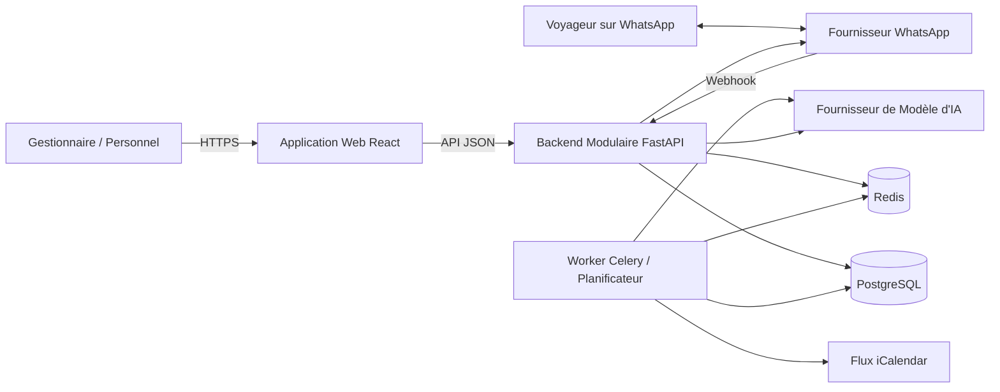

# Chapitre 09 : Architecture Système

**Statut :** Architecture logique proposée ; les détails d'implémentation sont susceptibles d'évoluer

## Style Architectural

Vayca est conçu dès l'origine comme un monolithe modulaire plutôt que comme un système en microservices. Un monolithe modulaire consiste en une application backend unique déployable, dotée de frontières de modules internes rigoureusement explicites. Cette approche réduit la charge d'exploitation liée au déploiement et au débogage pour une équipe restreinte de trois personnes, tout en préservant une trajectoire d'évolution claire vers l'extraction future de services indépendants si la montée en charge le justifie.

Le système s'appuie sur le socle technologique suivant :

- React et TypeScript pour l'application cliente web ;
- FastAPI pour la fourniture des API RESTful HTTP et la réception des points de terminaison de webhooks (*webhook endpoints*) ;
- PostgreSQL pour la persistance transactionnelle des données relationnelles ;
- SQLAlchemy pour le mappage objet-relationnel (ORM) ;
- Alembic pour la gestion versionnée des migrations de schéma de base de données [REF-ALEMBIC] ;
- Redis et Celery pour l'exécution des traitements asynchrones et des tâches planifiées ;
- Un fournisseur de modèle d'intelligence artificielle pour la génération et la classification du chatbot ;
- L'API WhatsApp Cloud ou un adaptateur compatible multi-fournisseurs pour la messagerie instantanée ;
- Des flux iCalendar pour assurer l'interopérabilité initiale avec les calendriers externes.

## Vue au Niveau Conteneur



## Couches Logicielles du Backend

### Couche API (*API layer*)

- Routage des requêtes HTTP
- Validation syntaxique et sémantique des requêtes entrantes
- Dépendances d'authentification
- Contrôles d'autorisation et d'habilitation
- Sérialisation et schémas de réponse
- Accusé de réception immédiat des webhooks

### Couche Application (*Application layer*)

- Orchestration des cas d'utilisation métier (*use cases*)
- Délimitation des frontières transactionnelles
- Coordination inter-modules
- Répartition et émission des tâches d'arrière-plan (*background jobs*)
- Application des règles de politique d'action du chatbot

### Couche Domaine (*Domain layer*)

- Règles de calcul de disponibilité
- Logique de détection des chevauchements de réservations (*overlaps*)
- Règles de transition d'état du cycle de vie des tickets
- Gestion de l'état des conversations
- Définition des rôles et des permissions

### Couche Infrastructure (*Infrastructure layer*)

- Dépôts de données SQLAlchemy (*repositories*)
- Adaptateurs vers les fournisseurs et services externes
- Définition et exécution des tâches ouvrières Celery
- Journalisation centralisée (*logging*)
- Chargement et injection de la configuration

## Structure Recommandée du Backend

```text
backend/app/
|-- main.py
|-- core/
|   |-- config.py
|   |-- database.py
|   |-- security.py
|   `-- errors.py
|-- modules/
|   |-- identity/
|   |-- properties/
|   |-- calendar/
|   |-- messaging/
|   |-- chatbot/
|   |-- maintenance/
|   `-- dashboard/
|-- integrations/
|   |-- ical/
|   |-- whatsapp/
|   `-- ai/
|-- workers/
|   `-- tasks.py
|-- migrations/
`-- tests/
```

Cette organisation constitue un cadre directeur soumis à concertation. Le responsable de la base de données peut affiner la nomenclature des répertoires tout en préservant la responsabilité exclusive de chaque module et la direction des dépendances.

## Architecture Frontend

L'architecture du frontend reflète fidèlement les parcours opérationnels des utilisateurs :

```text
frontend/src/
|-- app/
|-- components/
|-- features/
|   |-- auth/
|   |-- dashboard/
|   |-- calendar/
|   |-- messages/
|   |-- maintenance/
|   |-- properties/
|   `-- settings/
|-- services/
|-- types/
`-- styles/
```

La navigation principale recommandée pour l'interface utilisateur s'articule comme suit :

1. Tableau de bord (*Dashboard*)
2. Calendrier (*Calendar*)
3. Messages
4. Maintenance
5. Propriétés (*Properties*)
6. Paramètres (*Settings*)

Les vues détaillées des propriétés et les fils de discussion des conversations constituent des routes de navigation approfondie (*drill-down*) et non des destinations directes de premier niveau.

## Architecture d'Authentification

Le socle validé pour le MVP met en œuvre une authentification par identifiant e-mail et mot de passe, comprenant :

- le hachage sécurisé des mots de passe au moyen de `pwdlib` et de l'algorithme Argon2id ;
- l'émission de jetons de session opaques et aléatoires, seuls les hachages cryptographiques de ces jetons étant persistés dans PostgreSQL ;
- l'attribution d'un cookie de session sécurisé doté des indicateurs `HttpOnly` et `SameSite=Lax`, couplé à un jeton CSRF distinct transmis par en-tête ;
- une durée d'expiration configurable de huit heures, assortie d'une révocation immédiate en cas de déconnexion volontaire ou de désactivation du compte ;
- un mécanisme de limitation du débit (*rate limiting*) des tentatives infructueuses adossé à Redis, indexé par adresse e-mail normalisée et adresse IP client ;
- des dépendances FastAPI réutilisables pour extraire l'utilisateur actif, contrôler le rôle gestionnaire, injecter le contexte d'entreprise et valider les jetons CSRF ;
- la vérification stricte des rôles gestionnaire (*manager*) et personnel opérationnel (*staff*) ;
- la résolution systématique du contexte d'entreprise pour toute requête authentifiée.

Les recommandations de sécurité de FastAPI préconisent expressément la bibliothèque de hachage Argon2 retenue [REF-FASTAPI-SECURITY]. Vayca fait délibérément le choix de sessions révocables gérées côté serveur en lieu et place de jetons JWT stockés côté client dans le navigateur. La décision 0003 consigne formellement cette orientation technique. L'environnement de production exige l'activation intégrale de HTTPS, de cookies sécurisés (*Secure flag*) et d'un adaptateur opérationnel d'envoi d'e-mails d'invitation.

## Règle des Requêtes Multi-Locataires

Pour chaque opération requérant une authentification :

1. Hacher le jeton de session fourni et récupérer son enregistrement valide, non expiré et non révoqué.
2. Charger l'enregistrement de l'utilisateur actif.
3. Résoudre l'identifiant `company_id` et le rôle à partir de l'état de confiance de la base de données.
4. Appliquer les contrôles d'autorisation selon le rôle de l'utilisateur.
5. Restreindre l'ensemble des requêtes de données appartenant au locataire à cette unique entreprise.
6. Consigner l'identité de l'opérateur pour toute modification sensible ou opération d'audit.

La valeur de `company_id` fournie directement par un client ne doit en aucun cas être considérée comme une source d'autorisation fiable.

## Traitement en Arrière-Plan

L'attribution de tâches en arrière-plan est requise pour les opérations suivantes :

- le rafraîchissement planifié et périodique des flux de calendrier externes ;
- l'analyse syntaxique (*parsing*) des flux et le calcul des conflits de réservation ;
- le traitement asynchrone des inférences de l'agent conversationnel (chatbot) lorsque l'accusé de réception des webhooks impose une latence minimale ;
- la réémission avec réessais des messages sortants en échec ;
- les sondes de surveillance de l'état de fonctionnement des intégrations (*health checks*) ;
- la génération ultérieure de rapports et de bilans consolidés.

Chaque tâche doit impérativement présenter une nature idempotente, dans la mesure où les files de messages et les récepteurs de webhooks sont susceptibles de réémettre des distributions en doublon.

## Principes des Contrats d'API

- Structurer l'ensemble des points d'accès sous des routes d'API versionnées, par exemple `/api/v1`.
- Garantir l'uniformité des schémas de requête et de réponse au moyen de modèles Pydantic standardisés.
- Adopter un format de retour d'erreur unique et rigoureusement documenté.
- Distinguer formellement les codes d'erreur `401 Unauthorized` (authentification requise ou invalide) et `403 Forbidden` (droits d'accès insuffisants).
- Intégrer un mécanisme de pagination systématique pour les collections de données extensibles.
- Dissocier clairement les codes d'état lisibles par machine des libellés textuels destinés à l'affichage dans l'interface utilisateur.
- Générer automatiquement la spécification OpenAPI interactive pour assurer un alignement continu avec les équipes frontend.

## Environnements de Déploiement

| Environnement | Objectif | Nature des Données |
|---|---|---|
| Développement | Développement local et tests unitaires de fonctionnalités | Données locales, fictives ou jeux d'essais |
| Test / Intégration Continue (CI) | Vérification automatisée et exécution des suites de tests | Base de données éphémère réinitialisée |
| Pré-production (*Staging*) | Démonstrations intégrées et validations fonctionnelles | Données contrôlées représentatives hors production |
| Production / Pilote | Exploitation réelle par les clients pilotes | Données réelles protégées et sauvegardées |

Le cadre du stage d'ingénieur peut initialement concentrer ses déploiements sur les environnements de développement et de pré-production, mais la conception de la configuration logicielle ne doit en aucun cas être restreinte à une cible unique.
