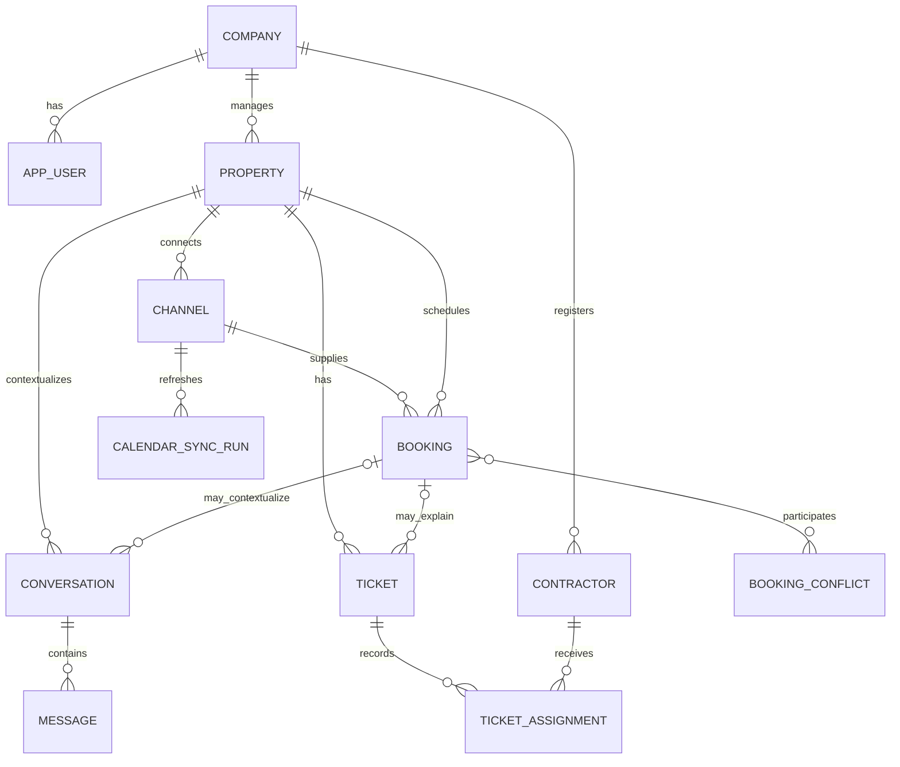

# Chapitre 10 : Conception des Données

**Statut :** Modèle de domaine provisoire ; socle initial de schéma implémenté, le DDL final et la sémantique des flux restent soumis à la revue d'équipe

## Objectifs de Modélisation

- Représenter une ou plusieurs propriétés rattachées au compte d'une entreprise.
- Préserver l'historique complet des réservations, des conversations et des interventions de maintenance.
- Prendre en charge une synchronisation robuste et fiable des événements externes.
- Appliquer rigoureusement l'isolation multi-locataire (*tenant isolation*) et l'intégrité référentielle des clés.
- Fournir une traçabilité auditable pour l'ensemble des actions du chatbot et des interventions du personnel.
- Éviter l'introduction superflue d'entités de place de marché (*marketplace*), de traitement de paiement, de comptes d'accès pour les voyageurs ou de sessions pour les prestataires.

## Modèle Conceptuel

## Entités Candidates

### Company

Représente l'espace de travail d'une agence de gestion locative ou d'un propriétaire indépendant.

Champs candidats :

- `id`
- `name`
- `status`
- `timezone`
- `default_currency`
- `created_at`, `updated_at`

### AppUser

Représente un utilisateur interne, qu'il s'agisse d'un gestionnaire (*manager*) ou d'un membre du personnel opérationnel (*staff*).

Champs candidats :

- `id`, `company_id`
- `name`, `email`
- `password_hash`
- `role` : manager ou staff
- `status`
- `last_login_at`
- horodatages d'audit (`created_at`, `updated_at`)

Le socle de référence du MVP retient l'unicité globale des adresses e-mail des utilisateurs de l'application, tel que consigné dans `docs/decisions/0001-initial-database-schema.md`. Ce choix simplifie l'authentification en dispensant l'utilisateur de devoir sélectionner au préalable son entreprise avant sa connexion. Si une même personne physique doit ultérieurement appartenir à plusieurs entreprises distinctes, l'équipe réévaluera cette disposition et mettra en œuvre la migration nécessaire vers une table d'adhésion aux comptes (*account-membership*).

### AuthSession

Représente une session de navigation révocable gérée côté serveur. Elle stocke l'identité de l'entreprise et de l'utilisateur, un hachage cryptographique unique du jeton opaque, un hachage du jeton CSRF, les dates d'expiration, de révocation ainsi que les horodatages d'audit. Les secrets bruts du jeton de session et du jeton CSRF ne sont jamais persistés en clair dans la base de données.

### UserInvitation

Représente une invitation créée par un gestionnaire à l'attention d'un futur membre du personnel. Elle stocke l'entreprise, l'utilisateur invité, l'auteur de l'invitation, un hachage unique du jeton d'invitation à usage unique, sa date d'expiration, son horodatage d'acceptation et les horodatages d'audit. L'adaptateur de l'environnement de développement peut afficher l'URL d'activation une unique fois dans les journaux système ; un adaptateur de production doit obligatoirement l'acheminer via un service d'envoi d'e-mails agréé.

### Property

Représente un logement ou bien immobilier géré.

Champs candidats :

- `id`, `company_id`
- champs de désignation et d'adresse
- ville et fuseau horaire
- capacité d'accueil et état opérationnel
- consignes et horaires d'arrivée et de départ (*check-in / check-out*)
- coordonnées Wi-Fi, stationnement, équipements, règlement intérieur, contact d'urgence
- lien de réservation externe
- horodatage d'archivage doux (*archived_at*)
- horodatages d'audit (`created_at`, `updated_at`)

Les attributs opérationnels sensibles requièrent un contrôle d'habilitation strict et une exposition restreinte et prudente auprès du modèle de chatbot.

### Channel

Représente l'interconnexion d'une propriété avec une source externe de réservation.

Champs candidats :

- `id`, `property_id`
- plateforme ou type de source
- identifiant externe de l'annonce
- URL du calendrier iCalendar ou référence chiffrée d'intégration
- indicateur d'état actif
- horodatage de la dernière synchronisation réussie
- résumé textuel de la dernière erreur constatée

### Booking

Représente une réservation (importée d'un canal externe ou saisie manuellement) ou une période d'indisponibilité bloquée.

Champs candidats :

- `id`, `property_id`
- `channel_id` nullable (pour les réservations directes ou saisies manuelles)
- type de source
- identifiant d'événement externe
- nom et coordonnées du voyageur (lorsqu'ils sont disponibles)
- horodatages et dates d'arrivée (*check-in*) et de départ (*check-out*)
- statut
- type d'enregistrement : réservation ferme (*reservation*) ou période bloquée (*blocked period*)
- horodatage de dernière mise à jour externe
- horodatages d'audit (`created_at`, `updated_at`)

Règles d'intégrité candidates :

- la date de départ (*check-out*) doit être strictement postérieure à la date d'arrivée (*check-in*) ;
- l'identifiant externe doit être unique au sein d'un même canal (`channel_id`) ;
- les enregistrements annulés ne sont pas comptabilisés comme des périodes d'occupation ;
- les séjours consécutifs ne constituent pas un chevauchement lorsque la date de départ d'une réservation coïncide avec la date d'arrivée de la suivante ;
- la charge utile externe brute (*payload*) peut être conservée dans un champ JSON encadré pour faciliter le diagnostic technique, sous réserve d'une politique de purge et de rétention.

### CalendarSyncRun

Enregistre les données d'observabilité liées aux cycles de synchronisation :

- canal concerné
- horodatages de début et d'achèvement
- état d'exécution (succès, échec, partiel)
- décompte des événements créés, mis à jour, annulés et rejetés
- message d'erreur assaini et expurgé de données confidentielles
- identifiant de corrélation pour le traçage distribué

### BookingConflict

Modélise un état persistant de conflit de dates ou de surréservation (*double-booking*), plutôt qu'une notification purement volatile.

Champs candidats :

- propriété concernée
- réservations participantes (via une table d'association dédiée si nécessaire)
- horodatage de détection
- statut : ouvert (*open*), acquitté (*acknowledged*), résolu (*resolved*), ignoré (*dismissed*)
- note explicative de résolution
- identifiant de l'opérateur et horodatage de résolution

### Conversation

Représente le contexte unifié des échanges avec un voyageur donné.

Champs candidats :

- `id`, `company_id`, `property_id`
- `booking_id` associé, facultatif ou actif
- identifiant de contact du voyageur (ex. numéro WhatsApp)
- statut de la conversation
- mode de gestion : automatique (*automatic*) ou manuel (*manual*)
- utilisateur du personnel assigné (facultatif)
- horodatage du dernier message reçu ou envoyé
- horodatages d'audit (`created_at`, `updated_at`)

L'unicité de la conversation nécessite une validation rigoureuse. Une règle pratique et robuste pour le MVP consiste à imposer une unique conversation active par triplet (entreprise, propriété, contact voyageur), avec rattachement contextuel optionnel à une réservation.

### Message

Modélise chaque message individuel au sein d'un fil de discussion.

Champs candidats :

- `id`, `conversation_id`
- identifiant externe de message ou du fournisseur
- direction : entrant (*inbound*) ou sortant (*outbound*)
- type d'expéditeur : voyageur (*guest*), chatbot, personnel (*staff*), système
- identifiant de l'utilisateur émetteur le cas échéant
- langue détectée ou employée
- contenu textuel
- statut de distribution (reçu, envoyé, distribué, lu, en échec)
- indicateur d'émission automatique (*is_automatic*)
- référence de version du modèle ou de configuration le cas échéant
- indice de confiance et motif d'escalade le cas échéant
- horodatages fournis par le transporteur et horodatages d'audit locaux

### Contractor

Représente un prestataire de services externe (plombier, électricien, technicien) enregistré sous forme de fiche de contact, et non comme un utilisateur authentifié de la plateforme.

Champs candidats :

- `id`, `company_id`
- nom complet
- numéro de téléphone
- spécialité ou corps de métier
- notes opérationnelles
- indicateur d'état actif
- horodatages d'audit (`created_at`, `updated_at`)

### Ticket

Modélise une intervention de maintenance ou un incident opérationnel.

Champs candidats :

- `id`, `company_id`, `property_id`
- `booking_id` et `conversation_id` optionnels
- titre synthétique et description détaillée
- catégorie technique et niveau de priorité
- statut du ticket (ouvert, en cours, résolu, annulé)
- identifiant de l'utilisateur créateur
- indicateur ou référence de suggestion par l'agent conversationnel (*suggested by chatbot*)
- horodatage de résolution effective
- horodatages d'audit (`created_at`, `updated_at`)

### TicketAssignment

Conserve l'historique immuable des attributions d'un ticket :

- ticket et prestataire désigné
- utilisateur ayant procédé à l'affectation
- horodatage de début d'affectation
- horodatage de fin ou de réattribution
- consignes et notes d'intervention

## Stratégie d'Isolation Multi-Locataire

Le socle MVP validé intègre systématiquement la colonne `company_id` dans chaque table rattachée à un locataire et l'inclut dans des clés étrangères composites liant les enregistrements d'une même entreprise, comme spécifié dans `docs/decisions/0001-initial-database-schema.md`. Cette approche formalise explicitement le filtrage multi-locataire et permet au moteur PostgreSQL de rejeter immédiatement toute association qui franchirait les limites d'une entreprise au niveau de la couche d'intégrité relationnelle.

Les dépôts (*repositories*) et services de l'application doivent néanmoins continuer à dériver l'identifiant de l'entreprise à partir du contexte de session authentifié côté serveur et restreindre chaque requête SQL à cette entreprise. Les contraintes relationnelles en base assurent une défense en profondeur essentielle ; elles ne sauraient se substituer au contrôle d'accès applicatif. Des tests d'intégrité inter-entreprises (*cross-company persistence tests*) sont obligatoires avant de prononcer l'achèvement des modules fonctionnels dépendants.

## Cycle de Vie des Données

- Privilégier l'archivage doux (*soft-delete*) ou la désactivation logique plutôt que la suppression physique destructive des historiques opérationnels.
- Formaliser des règles de durée de conservation pour les coordonnées des voyageurs, les contenus de messages, les charges utiles des services tiers et les fichiers journaux.
- Définir des procédures claires de rectification et de purge des données personnelles conformément aux exigences légales de protection de la vie privée.
- Proscrire formellement l'inscription de données secrètes, de jetons d'accès ou de codes d'entrée de propriétés dans les fichiers journaux (*logs*).
- Sauvegarder systématiquement les données de production et de pilote, et valider périodiquement les procédures de restauration.

## Stratégie de Migration

La migration initiale doit créer exclusivement les entités et contraintes formellement approuvées. Chaque évolution ultérieure de schéma doit faire l'objet d'un script de migration Alembic rigoureusement revu. Les migrations produites par détection automatique (*autogenerate*) doivent être scrupuleusement inspectées avant exécution, l'automatisation ne dispensant en aucun cas d'une validation de la sémantique du domaine métier [REF-ALEMBIC].

## Grille de Revue de la Base de Données

- [x] Nomenclature définitive des entités validée pour le socle initial du MVP
- [x] Stratégie d'isolation multi-locataire approuvée
- [x] Décision d'unicité globale des adresses e-mail approuvée
- [x] Sémantique des dates de réservation et gestion des fuseaux horaires approuvée
- [x] Politique de prise en compte des annulations iCalendar approuvée
- [x] Règle d'unicité et de cycle de vie des conversations approuvée
- [x] Diagramme des transitions d'état des tickets de maintenance approuvé
- [x] Contraintes d'unicité et index de performance identifiés
- [x] Champs d'audit et horodatages uniformisés pour le socle initial du MVP
- [ ] Politique de rétention et de protection des données sensibles documentée
- [x] Exécution complète des étapes d'application (*upgrade*), d'annulation (*downgrade*) et de réapplication (*re-upgrade*) de la migration initiale sur une base PostgreSQL vierge
- [x] Validation des tests d'intégrité des clés étrangères inter-entreprises et de non-chevauchement des dates de réservation
