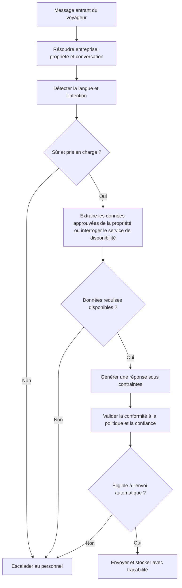

# Chapitre 11 : Conception du Chatbot et Intégrations

**Statut :** Socle proposé pour la sécurité et les intégrations

## Rôle du Chatbot

L'agent conversationnel (chatbot) de Vayca constitue une composante de communication assistée et encadrée, et non un gestionnaire de propriété autonome. Il est habilité à extraire des faits vérifiés, générer des réponses rédigées dans plusieurs langues, classifier les requêtes des voyageurs et suggérer des actions opérationnelles structurées. En revanche, il lui est formellement interdit d'annuler de manière autonome des réservations, de résoudre des conflits de dates, d'assigner des prestataires externes, d'approuver des remboursements ou d'engager des modifications opérationnelles irréversibles à fort impact.

## Langues Prises en Charge pour le MVP

- Français
- Anglais
- Arabe

Les bancs d'évaluation doivent englober à la fois l'arabe standard moderne et des expressions représentatives de l'arabe dialectal tunisien (*derja*). La seule prise en charge générique d'une langue par un grand modèle de fondation (*LLM*) ne saurait constituer une preuve de qualité opérationnelle sur le marché local.

## Politique de Réponse

### Catégorie des réponses automatiques

- Coordonnées et mot de passe du réseau Wi-Fi
- Horaires et consignes d'arrivée et de départ (*check-in / check-out*)
- Itinéraire d'accès et facilités de stationnement
- Équipements de la villa ou de l'appartement
- Règlement intérieur de l'hébergement
- Coordonnées du contact d'urgence préalablement approuvées
- Disponibilités réelles extraites directement auprès du backend
- Lien de réservation directe ou externe configuré par le gestionnaire

### Catégorie soumise à confirmation humaine

- Proposition de création d'un ticket de maintenance
- Proposition d'un niveau de priorité ou d'une catégorie technique d'incident
- Message d'information du voyageur consécutif à l'avancement d'un ticket
- Demandes particulières ambiguës ou atypiques

### Catégorie d'escalade obligatoire

- Litiges financiers, demandes de compensation ou réclamations de remboursement
- Demandes d'annulation de séjour ou modifications de dates de réservation
- Plaintes formelles et mécontentement prononcé
- Situations d'urgence médicale, de sinistre ou d'atteinte à la sécurité
- Détection d'un conflit de réservation ou surréservation (*double-booking*)
- Informations sur la propriété absentes, incomplètes ou contradictoires
- Score de confiance du modèle insuffisant lors de l'interprétation de l'intention
- Détection d'une langue non prise en charge ou défaillance technique du fournisseur d'IA

## Flux de Réponse Ancrée (Grounded-Answer Flow)



## Frontière des Outils (Tool Boundary)

L'agent conversationnel a la faculté d'invoquer des outils logiciels fournis par le backend au moyen d'arguments d'entrée structurés. Le backend demeure l'unique propriétaire de l'exécution métier et des contrôles d'autorisation.

Outils candidats :

- `get_property_information(property_id, fields)` : extraction des données descriptives et consignes de la villa ;
- `check_availability(property_id, check_in, check_out)` : vérification en temps réel des créneaux libres ;
- `get_booking_context(conversation_id)` : récupération des détails du séjour rattaché ;
- `suggest_ticket(conversation_id, category, priority, description)` : formulation d'une proposition d'intervention.

L'outil `suggest_ticket` crée exclusivement une suggestion en attente d'approbation et n'instancie aucun ticket réel. C'est la confirmation explicite par un membre du personnel qui déclenche le cas d'utilisation standard de création d'un ticket dans le système.

## Stratégie de Prompts et de Modèles

- Conserver une sélection paramétrable et modulaire du modèle et du fournisseur d'IA.
- Déployer une politique système (*system prompt*) formalisant explicitement les actions autorisées, celles soumises à confirmation humaine et les cas d'escalade immédiate.
- Injecter strictement le volume minimal d'informations autorisées sur la propriété au sein du contexte d'invite.
- Dissocier méthodiquement les données factuelles et déterministes issues du backend du texte rédigé en langage naturel par le modèle génératif.
- Consigner systématiquement l'identifiant et la version de la configuration du modèle à des fins de traçabilité et d'audit.
- Proscrire formellement l'inclusion de secrets d'authentification ou de données relatives à des entreprises tierces dans les prompts.
- Exploiter des métriques d'évaluation formalisées pour comparer la précision, la latence de réponse et les coûts d'inférence.

L'API Evals d'OpenAI permet d'administrer des jeux de données d'évaluation reproductibles et des évaluateurs automatiques ; le projet peut s'appuyer sur cette solution ou sur un banc de test local équivalent [REF-OPENAI-EVALS].

## Intégration du Calendrier

### Socle iCalendar

La spécification RFC 5545 formalise un protocole standard d'échange de données de calendrier indépendant de tout service commercial tiers [REF-IETF-ICAL]. L'intégration initiale de Vayca traite les flux iCalendar comme une source d'importation unidirectionnelle de disponibilités, sans promettre les fonctionnalités complètes d'une API bidirectionnelle officielle non bridée.

### Comportement de synchronisation

1. Le gestionnaire ajoute l'URL d'un flux iCalendar au canal d'une propriété.
2. Le système valide la structure de l'URL et enregistre la configuration de manière chiffrée et sécurisée.
3. Un worker Celery planifié télécharge périodiquement le contenu distant du flux.
4. L'analyseur syntaxique normalise les événements au format standardisé interne.
5. La logique de synchronisation (*upsert*) insère, met à jour ou annule les enregistrements de manière idempotente.
6. Le moteur de détection des conflits analyse l'ensemble des plages de dates actives modifiées.
7. L'état d'intégrité et de santé de la synchronisation est consigné et affiché dans l'interface de gestion.

### Limites à communiquer

- La fraîcheur temporelle des réservations dépend de la périodicité de scrutation (*polling*) et du comportement de la plateforme source.
- Les flux iCalendar n'acheminent qu'un sous-ensemble restreint d'informations et omettent fréquemment l'identité complète des voyageurs, les décompositions tarifaires ou les statuts avancés.
- L'importation de disponibilités par iCalendar ne saurait constituer un gestionnaire de canaux bidirectionnel complet (*two-way channel manager*).
- Dans le cadre de son périmètre initial, Vayca n'altère ni ne modifie automatiquement les réservations directement sur les plateformes tierces d'origine.

## Intégration de WhatsApp

### Modes de développement

| Mode | Objectif |
|---|---|
| Simulateur | Tests locaux unitaires et validation déterministe au sein de l'intégration continue (CI) |
| Test fournisseur | Validation réelle de la réception des webhooks et de la transmission de messages à l'aide d'identifiants et de numéros de test dédiés |
| Production / Pilote | Exploitation avec un compte d'entreprise vérifié (*WhatsApp Business Account*) et des échanges réels avec les voyageurs |

### Exigences relatives aux webhooks

- Valider l'authenticité de la source conformément aux spécifications cryptographiques du fournisseur (vérification de signature HMAC).
- Émettre un accusé de réception HTTP quasi immédiat (`202 Accepted` ou `200 OK`) et déléguer les traitements complexes au worker asynchrone.
- Garantir le dédoublonnage des événements à partir de l'identifiant unique de message fourni par le transporteur.
- Suivre et refléter les évolutions des statuts de distribution (émis, distribué, lu).
- Éviter l'inscription intégrale de données sensibles au sein des fichiers journaux d'application.
- Encadrer les nouvelles tentatives d'émission de messages sortants par une politique de réessais bornée dans le temps.
- Garantir que le personnel peut reprendre manuellement et en toute circonstance la gestion d'un fil d'échange en cas de panne de l'IA ou du fournisseur.

### Contrat implémenté du simulateur local

Le simulateur de développement du MVP accepte un événement signé sur le point de terminaison `POST /api/v1/integrations/whatsapp/simulator/inbound`. La charge utile comprend l'identifiant de la propriété, l'identifiant de contact du voyageur, le corps du message, l'identifiant externe du message et, de manière optionnelle, un horodatage et une langue. Le point d'accès n'accepte pas de paramètre `company_id` : le backend résout de façon étanche le contexte de l'entreprise à partir de la propriété persistée. Le client appelant calcule une signature HMAC-SHA256 sur le corps JSON brut de la requête à l'aide du secret partagé du simulateur local et la transmet via l'en-tête `X-Vayca-Simulator-Signature`.

Le point de terminaison renvoie un accusé de réception `202 Accepted` après persistance idempotente de l'événement. Ce canal constitue un transport strictement dédié au développement et à l'intégration continue (CI), et ne doit en aucun cas être assimilé à une interconnexion WhatsApp de production agréée. Les modes de test fournisseur et de production demeurent des adaptateurs distincts prévus pour les phases ultérieures.

### Simulateur voyageur interactif WhatsApp Web et QR code de présentation

Afin de permettre des démonstrations immersives et réalistes en direct lors des soutenances de fin d'études et des évaluations académiques sans dépendre de comptes fournisseurs professionnels tiers externes (Twilio / Meta WhatsApp Business), la plateforme intègre un simulateur mobile pour les voyageurs (`/simulator/whatsapp`) ainsi qu'une modale de présentation avec QR code sur le poste de travail gestionnaire :

1. **Modale QR de Présentation (`SimulatorQrModal`) :** Accessible via le bouton « Démo WhatsApp » présent dans l'en-tête persistant du poste de travail, elle affiche un QR code vectoriel dynamique généré par un moteur TypeScript pur sans aucune dépendance externe, strictement conforme à la norme ISO/IEC 18004 (`qrCode.ts`). Les membres du jury scannent le code à l'aide de leur smartphone pour ouvrir instantanément l'interface du simulateur sans installation requise.
2. **Interface Mobile Voyageur (`GuestWhatsAppSimulatorPage`) :** Elle émule fidèlement l'interface de WhatsApp Web grâce aux codes visuels verts caractéristiques (`#075E54`), un sélecteur dynamique de villas, un numéro de téléphone voyageur modifiable (conservé dans le `localStorage`), des bulles de discussion enrichies de badges d'attribution de source (`🤖 IA Vayca` contre `👤 Équipe Vayca`), un indicateur animé de frappe en temps réel, ainsi que des boutons de suggestions rapides déclenchables en 1 clic (*WiFi*, *Piscine*, *Check-out*, *Panne Clim*).
3. **Points de Terminaison d'API Sécurisés :** Des routes dédiées (`/api/v1/integrations/whatsapp/simulator/chat/*`) permettent d'extraire la liste des villas actives, de consulter l'historique chronologique des messages et de propulser les messages entrants dans le pipeline Celery `process_chatbot_inbound_message`. L'ensemble de ces points de terminaison est protégé par le garde applicatif `check_simulator_mode()`, qui les désactive automatiquement dès lors que des adaptateurs de production sont activés.

## Exemple de Suggestion de Ticket

Message reçu du voyageur :

> Water is leaking under the kitchen sink. *(De l'eau fuit sous l'évier de la cuisine.)*

Résultat structuré généré par le chatbot :

```json
{
  "action": "suggest_ticket",
  "category": "plumbing",
  "priority": "medium",
  "description": "Guest reports water leaking under the kitchen sink.",
  "requires_staff_confirmation": true
}
```

L'interface opérationnelle met en exergue cette suggestion. L'opérateur humain peut ajuster le niveau de priorité, apporter des précisions contextuelles, sélectionner un prestataire agréé dans le répertoire et valider la création du ticket.

## Jeu de Données d'Évaluation

L'équipe projet doit maintenir un catalogue d'exemples d'évaluation versionné couvrant :

- les questions courantes portant sur les caractéristiques des villas ;
- les demandes relatives à des faits non consignés dans la base de connaissances ;
- les consultations portant sur des plages de dates disponibles et complètes ;
- les requêtes temporelles ambiguës ;
- les réclamations et demandes d'indemnisation financière ;
- les descriptions de dysfonctionnements techniques et d'avaries ;
- les situations d'urgence nécessitant une intervention immédiate ;
- les tentatives d'évasion ou d'injection de prompts (*prompt injection*) ;
- les variations linguistiques en français, anglais, arabe standard moderne et arabe dialectal tunisien ;
- les messages accidentellement associés à une villa erronée ou non identifiée.

Les métriques d'évaluation retenues doivent quantifier l'exactitude de la classification, le taux d'ancrage factuel (*groundedness*), la conformité des décisions d'escalade humaine, la justesse linguistique, les temps de réponse de bout en bout et les coûts estimés d'inférence.
