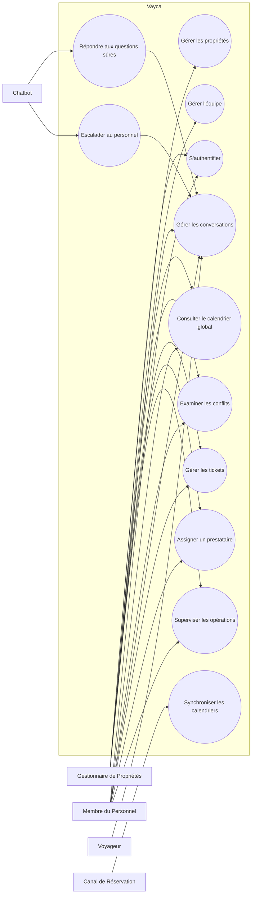
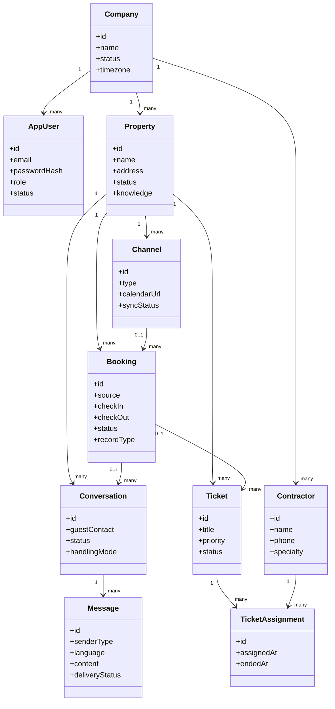
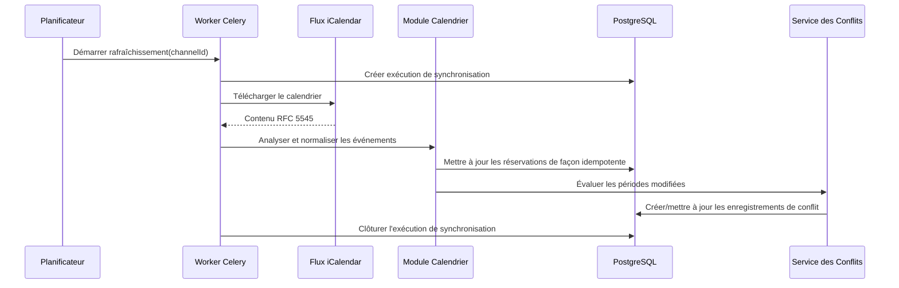
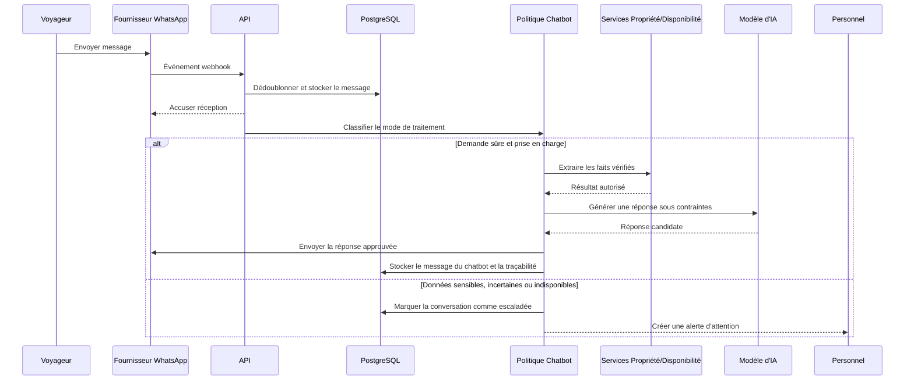
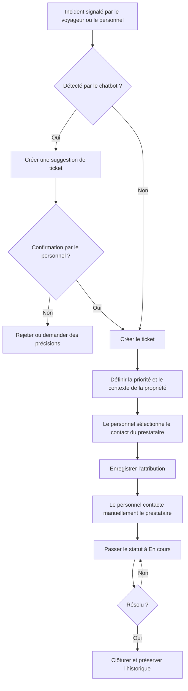
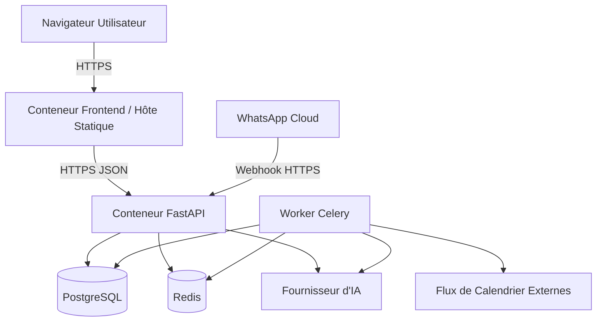

# Chapitre 12 : Modèles UML et Workflows Opérationnels

**Statut :** Modèles de conception éditables ; les diagrammes doivent évoluer avec les exigences approuvées

## Diagramme des Cas d'Utilisation Système

Le diagramme de cas d'utilisation ci-dessous formalise les interactions fonctionnelles entre les acteurs opérationnels et le système Vayca.

Le prestataire externe est intentionnellement omis en tant qu'acteur du système, dans la mesure où les prestataires ne disposent d'aucun compte d'authentification sur la plateforme au sein du périmètre du MVP.

## Diagramme de Classes Métier

Le diagramme de classes suivant expose la structure du domaine métier et les associations cardinales liant les entités fondamentales.

## Séquence de Synchronisation des Calendriers

Ce diagramme illustre le flux asynchrone d'acquisition d'un flux iCalendar, l'analyse syntaxique des données au standard RFC 5545, l'insertion idempotente en base de données et l'évaluation proactive des conflits de réservation.

## Séquence du Message Voyageur et du Chatbot

Ce diagramme présente le cycle complet de traitement d'un message entrant, depuis la réception du webhook WhatsApp et le dédoublonnage, jusqu'au filtrage de sûreté, l'ancrage factuel des réponses et le mécanisme d'escalade immédiate auprès du personnel.

## Diagramme d'Activité de la Maintenance

Ce diagramme d'activité modélise le cycle opérationnel de traitement des pannes, de la détection initiale (par signalement direct ou suggestion de l'IA) jusqu'à la confirmation humaine, la sélection du prestataire et la résolution consignée.

## Diagramme de Déploiement

Ce diagramme décrit la disposition physique et conteneurisée des composants logiciels au sein de l'environnement de déploiement.

## Règle de Maintenance des Diagrammes

Lorsqu'une exigence formellement approuvée modifie un acteur, une entité, un flux opérationnel, une dépendance inter-modules ou un composant d'infrastructure de déploiement, le ou les diagrammes associés doivent impérativement être mis à jour dans le cadre de la même *pull request*.
