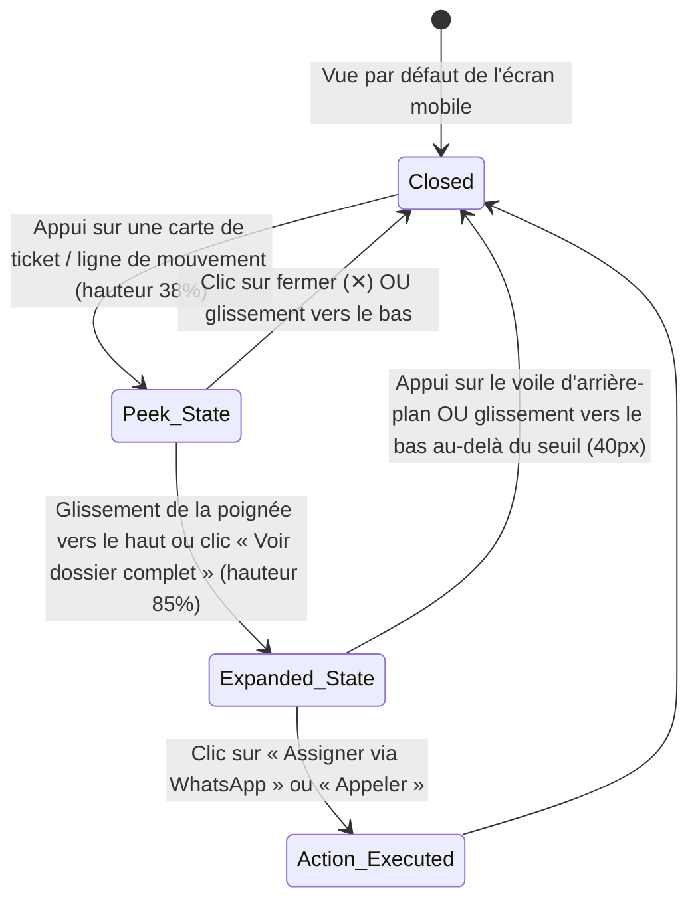

# Chapitre 18 : Architecture des Prototypes UI/UX et Spécifications d'Interaction

**Statut :** Spécification architecturale approuvée et référentiel de conception senior  
**Projet :** Station de travail des opérations exécutives Vayca (`3851962757848407279`)  
**Ressource du système de design :** `assets/496e7233faec4294af96b3635c2df3d6` (Opérations Architecturales Méditerranéennes)  
**Fenêtres d'affichage cibles (Viewports) :** Bureau / Desktop (1440x900px / 2560x1440px), Téléphone mobile (390x844px iPhone 15 Pro / 360px Android)  
**Vérification principale :** Traçabilité académique vis-à-vis des exigences NFR-UX-01 à NFR-UX-06 et NFR-AI-02

---

## 1. Résumé Exécutif et Fondations du Système de Design

L'interface de Vayca conjugue la sérénité structurelle du style vernaculaire méditerranéen de Sidi Bou Saïd avec la haute densité utilitaire requise par les opérations d'hôtellerie commerciale. Conçue pour les agences de gestion immobilière tunisiennes et les gestionnaires de villas de luxe indépendantes, la plateforme substitue aux empilements génériques de « cartes flottantes » des solutions SaaS une **architecture de poste de travail à volets fractionnés (*architectural split-pane workstation layout*)**.

### 1.1 Matrice des Jetons de Couleur et Rôles Sémantiques

| Nom du jeton (*Token Name*) | Valeur hexadécimale | Classe Tailwind | Rôle sémantique et ratio de contraste |
|---|---|---|---|
| **Sidi Bou Said Azure** | `#0F3D5E` | `bg-azure-600`, `text-azure-600` | Autorité principale de la marque, icônes du rail de navigation gauche, actions secondaires, bordures des lignes sélectionnées. Contraste AAA (9,8:1) sur fond `#FAF8F5`. |
| **Azure Surface Highlight** | `#F0F6FA` | `bg-azure-50` | Arrière-plan de l'élément actif du rail de navigation, lignes de tableau mises en évidence, pastilles (*chips*) sélectionnées. |
| **Azure Sub-Border** | `#B6DAEA` | `border-azure-200` | Délimitations de sélection active, bordures des pastilles secondaires. |
| **Terracotta Clay** | `#D96B43` | `bg-terracotta-500` | Accent principal des actions transactionnelles, boutons d'appel à l'action primaires (CTA : `+ New Booking`, `+ New Order`), badges d'urgence. Contraste AAA (4,6:1) sur fond blanc. |
| **Terracotta Hover** | `#C25730` | `hover:bg-terracotta-600` | État assombri au survol / appui tactile. |
| **Terracotta Alert Surface** | `#FDF4F0` | `bg-terracotta-50` | Arrière-plan des bandeaux d'alerte pour les escalades managériales et avertissements critiques. |
| **Terracotta Alert Stroke** | `#FBE6DC` | `border-terracotta-100` | Filet de bordure de 1px encadrant les bannières d'escalade. |
| **Warm Sun Amber** | `#E8A838` / `#CF9024` | `bg-amber-500` | Pastilles de recommandation de prestataires par l'IA, notes par étoiles, indicateurs de canaux directs. |
| **Warm Sand Base** | `#FAF8F5` | `bg-sand-50` | Arrière-plan fondamental de l'application. Remplace les blancs cliniques agressifs par une tonalité diurne rappelant le plâtre à la chaux reposant pour la vue. |
| **Pure White Surface** | `#FFFFFF` | `bg-white`, `bg-sand-100` | Surfaces des cartes, volets du poste de travail, conteneurs tabulaires. Délimité par une bordure ultra-fine de 1px. |
| **Architectural Hairline** | `#EBE6DD` | `border-sand-200` | Filet architectural structurel de 1px encadrant les cartes, volets, lignes de tableau et vues fractionnées. Évite le recours aux ombres portées lourdes. |
| **Dark Espresso Text** | `#1C1B18` | `text-sand-900` | Titres principaux, texte primaire des lignes de tableau, valeurs numériques à haute lisibilité. |
| **Muted Sand Text** | `#78716C` | `text-sand-500` | Métadonnées secondaires, horodatages, sous-titres des canaux, textes d'aide contextuels. |
| **Critical Red** | `#DC2626` | `bg-red-600`, `text-red-600` | Chevauchements de réservations sur le calendrier, bannières de conflit, maintenance d'urgence. |
| **Conflict Surface** | `#FEF2F2` / `#FECACA`| `bg-red-50`, `border-red-200` | Arrière-plan et bordure de la bannière d'alerte de conflit. |
| **Success Green** | `#16A34A` | `bg-green-600`, `text-green-600` | Puce d'état opérationnel des canaux synchronisés, ordres de travail résolus, badges de paiement confirmé. |

### 1.2 Hiérarchie Typographique

La typographie est composée uniformément en **Plus Jakarta Sans** (Google Fonts), associant la rigueur géométrique d'une police sans-serif à des terminaisons humanistes adoucies :

- **Display 1 (H1 Bureau / Desktop)** : `24px` / `700 Bold` (`tracking-tight`, hauteur de ligne `32px`, `#1C1B18`).
- **Titre de section (H2 Bureau / H1 Mobile)** : `20px` / `700 Bold` (`tracking-tight`, hauteur de ligne `28px`, `#1C1B18`).
- **Titre de volet / Dossier (H3)** : `16px` / `700 Bold` (`tracking-normal`, hauteur de ligne `24px`, `#1C1B18`).
- **Corps de texte régulier (Body Regular)** : `14px` / `400 Regular` (hauteur de ligne `20px`, `#1C1B18`). Interlignage aéré de ratio `1.5` optimisé pour le français, l'anglais et les patronymes arabes translittérés.
- **Valeurs tabulaires et code** : `13px` / `600 SemiBold` (`tracking-tight`, alignement numérique à chasse fixe / monospace, `#3B3735`).
- **Badges d'état et de canal** : `11px` / `700 Bold` (`tracking-wider`, majuscules, `rounded-full`, marge interne / padding `2px 8px`).

---

## 2. Système de Mise en Page Global et Architecture du Poste de Travail

### 2.1 Découpage Tri-Volet du Poste de Travail Bureau (Base de Référence 1440px x 900px)

```
+---------+-------------------------------------------------------------+-------------------+
| 72px    | 64px Top Header: Operations > [Section]        [Primary CTA] | 64px Dossier Hdr  |
| Rail    +-------------------------------------------------------------+-------------------+
| [V]     |                                                             |                   |
| Dash    |                                                             | 380px Fixed       |
| Cal     | Main Workstation Canvas (~flex-1 / ~72% width)              | Right Inspector   |
| Msg (3) | Background: #FAF8F5 (Warm Sand)                             | Background: White |
| Mnt (2) | High-density tables, multi-property Gantt, or inbox feed    | Border-L: #EBE6DD |
| Prop    | Framing: 1px hairline dividers (#EBE6DD)                    | (Dossier & Triage)|
| Set     |                                                             |                   |
|         |                                                             | [Action Buttons]  |
| Avatar  |                                                             |                   |
+---------+-------------------------------------------------------------+-------------------+
```

1. **Rail de navigation gauche fixe (largeur de 72px)** :
   - Position fixe, hauteur totale de l'écran (`100vh`), arrière-plan `#FFFFFF`, bordure droite `1px solid #EBE6DD`.
   - Point d'ancrage supérieur : Badge logo monogramme géométrique Vayca (carré azur de 38x38px `#0F3D5E` orné d'un V blanc et d'un point terracotta `#D96B43`, `rounded-lg`).
   - Pile d'icônes (6 destinations) : Tableau de bord (*Dashboard*), Calendrier (*Calendar*), Messages, Maintenance, Propriétés (*Properties*), Paramètres (*Settings*).
   - Indicateur actif : Arrière-plan azur clair `#F0F6FA`, icône azur `#0F3D5E`, barre indicatrice latérale gauche `3px solid #0F3D5E`.
   - Compteur de badges : Pastille terracotta avec chiffre blanc en `10px bold` signalant les éléments non lus ou urgents.
   - Point d'ancrage inférieur : Avatar circulaire de l'entreprise (`Carthage Ops`) avec anneau d'état de connexion, suivi de l'icône de déconnexion.
2. **Barre d'en-tête supérieure standardisée (hauteur de 64px)** :
   - Hauteur exacte de `64px`, bordure inférieure `1px solid #EBE6DD`, arrière-plan `#FFFFFF`, marge interne horizontale (*padding*) de `24px`.
   - Fil d'Ariane (*Breadcrumb*) : `Operations > [Nom de Section]` accompagné d'un sous-titre contextuel.
   - Emplacement d'action : Bouton CTA primaire standardisé en Terracotta Clay (`#D96B43`, texte blanc, police semi-bold 14px, `rounded-lg`, survol `#C25730`, état actif `scale-98`).
3. **Zone de travail principale du poste de travail (~flex-1)** :
   - Arrière-plan `#FAF8F5`, espacement interne de `24px`, zone de défilement vertical ou horizontal.
   - Élimine les cartes à ombres portées prononcées ; regroupe les données à l'aide de bordures `#EBE6DD` de 1px, de surfaces blanches et d'alternances subtiles de teintes douces.
4. **Inspecteur droit standardisé et Dossier contextuel (largeur de 380px)** :
   - Largeur exacte de `380px`, hauteur totale fixe, bordure gauche `1px solid #EBE6DD`, arrière-plan `#FFFFFF` (ou `#FAF8F5` pour le volet d'IA des messages).
   - En-tête standardisé de 64px aligné sur la ligne de base de la barre supérieure, comportant le titre du volet et un bouton explicite de fermeture (`✕`).
   - Héberge les dossiers de réservation, les codes d'accès physiques, les audits de sécurité de l'IA et les panneaux d'assignation des prestataires en un clic.

---

### 2.2 Architecture Réactive Mobile (Base de Référence iPhone 390px x 844px)

En deçà du point de rupture de `768px` (`md`), le poste de travail se métamorphose en un outil opérationnel mobile aux sensations natives, optimisé pour les gestionnaires sur le terrain :

```
+---------------------------------------+
| 56px Top Header: [V] Vayca  [Bell] (O)|
+---------------------------------------+
| Scrollable Operational Canvas         |
| - Key Alert Card (Terracotta/Red)     |
| - Compact KPI Strip (2x2 Grid)        |
| - Single-Column Cards / Feed          |
| - Quick CTA Button                    |
|                                       |
| [ Bottom Sheet Drawer (Peek / Exp) ]  |
+---------------------------------------+
| 64px Bottom Docking Bar:              |
| [Dash] [Cal] [Msg(1)] [Mnt(3)] [Prop] |
+---------------------------------------+
```

1. **Barre supérieure mobile fixe (hauteur de 56px)** :
   - Arrière-plan `#FFFFFF`, bordure inférieure `1px solid #EBE6DD`, positionnement collant (`sticky top-0`), z-index `30`.
   - Affiche le badge monogramme de Vayca, le titre de l'écran courant, la cloche de notification avec point d'état non lu et l'avatar de Carthage Ops.
2. **Zone de défilement opérationnelle fluide en colonne unique** :
   - Arrière-plan `#FAF8F5`, espacement interne de `16px`, espacement inférieur de `96px` pour prévenir tout masquage par la barre inférieure de navigation.
   - Les tableaux se replient en cartes à fort contraste sur une colonne avec pastilles d'état proéminentes et zones tactiles étendues (minimum 44x44px).
3. **Architecture de tiroir inférieur glissant (*Bottom Sheet Drawer*)** :
   - Remplace l'inspecteur droit de 380px du poste de travail de bureau.
   - Trois crans d'ancrage (*snap points*) : **Fermé** (`0%`), **Aperçu / Peek** (`38%` de la hauteur de la fenêtre pour la télémétrie rapide et le code PIN), **Déployé / Expanded** (`85%` de la hauteur pour l'assignation complète de tickets ou la résolution de réservations).
   - Fermeture possible par glissement vers le bas sur la poignée de préhension ou par appui sur le voile d'arrière-plan assombri (`rgba(28,27,24,0.4)`).
4. **Barre de navigation inférieure d'amarrage fixe (hauteur de 64px + marge sécurisée *safe-area-inset*)** :
   - Arrière-plan `#FFFFFF`, bordure supérieure `1px solid #EBE6DD`, positionnement fixe en bas (`fixed bottom-0`), z-index `40`.
   - Cinq destinations rédigées en langage clair : **Tableau de bord (*Dashboard*)**, **Calendrier (*Calendar*)**, **Messages**, **Maintenance**, **Propriétés (*Properties*)**.
   - État actif : Icône et libellé en `#0F3D5E` accompagnés d'une barre indicatrice supérieure de `2px solid #0F3D5E`. Les paramètres et le sélecteur d'entreprise sont accessibles via le panneau de profil utilisateur.

---

## 3. Spécification Détaillée des Interactions Écran par Écran

### Écran 1 : Tableau de Bord (Poste de Commandement des Opérations - Dashboard)

- **Identifiant Bureau (Desktop ID)** : `f2debe8c5e584d1291da51d6d960293e` (Poste de travail standardisé)
- **Identifiant Mobile (Mobile ID)** : `ff533d1b41574328b5306fccf864ea34` (Tableau de bord opérationnel mobile)

#### Composants Clés et Matrice d'États :
1. **Bandeau d'alerte prioritaire (*Priority Alert Strip*)** :
   - *Par défaut* : Affiche l'avertissement de conflit actif (chevauchement Dar Sidi Bou Saïd) et la réclamation sensible du voyageur (demande de remboursement de Karim B.).
   - *Interaction* : Un clic sur « Examiner le conflit » (*« Review Conflict »*) redirige vers le Calendrier avec la date conflictuelle présélectionnée ; un clic sur « Reprendre la conversation » (*« Take Over Chat »*) ouvre la Messagerie sur le fil de Karim.
2. **Mouvements de voyageurs du jour (*Today's Guest Movements*)** :
   - *Onglets* : Contrôle segmenté basculant entre « Arrivées (2) » (*« Arrivals (2) »*) et « Départs (1) » (*« Departures (1) »*).
   - *Sélection de ligne* : Cliquer sur une ligne met à jour l'inspecteur droit avec le code PIN de la serrure connectée du voyageur, son numéro de téléphone et la liste de contrôle d'arrivée.
3. **Dossier de mouvement droit (380px Bureau / Tiroir inférieur Mobile)** :
   - Affiche le nom du voyageur, le canal de réservation (badge Airbnb Corail / Booking.com Marine), l'état de la batterie du digicode connecté (92 %) et le statut d'envoi automatisé par SMS/WhatsApp.

---

### Écran 2 : Calendrier (Poste de Travail Chronologique Multi-Propriétés - Calendar)

- **Identifiant Bureau (Desktop ID)** : `295b9d784ca64bf6850bf7e0b03da910` (Poste de travail standardisé)
- **Identifiant Mobile (Mobile ID)** : `efd2b48ae1d44494a0519748ae838a54` (Calendrier mobile et tri des conflits)

#### Composants Clés et Matrice d'États :
1. **Grille Gantt multi-propriétés sur 14 jours (Bureau)** :
   - Colonne gauche des propriétés fixe (*sticky*, 200px) avec pistes journalières horizontales (du 07 au 20 sept. 2026).
   - Visualisation des conflits de chevauchement : La zone de chevauchement (12-15 sept. sur Dar Sidi Bou Saïd) s'affiche avec un motif à rayures diagonales cramoisi/corail et une icône d'avertissement clignotante (`⚠️`).
2. **Défileur de dates mobile et cartes journalières (Mobile)** :
   - Défileur horizontal de bande de dates. Les dates présentant des conflits affichent une pastille rouge et un anneau cramoisi autour de la capsule du jour actif.
   - La carte de détail de la journée met en évidence les deux flux en conflit (Airbnb `#AB-9281` contre Réservation Directe `#DIR-104`).
3. **Boîte de dialogue / Inspecteur de tri et de résolution des conflits** :
   - Deux voies de résolution :
     - Option A : « Conserver la réservation Airbnb et annuler la réservation directe » (déclenche une notification automatisée au voyageur et débloque le calendrier).
     - Option B : « Réassigner la réservation directe à la Villa Carthage Topkapi » (vérifie la disponibilité et transfère l'unité).

---

### Écran 3 : Messagerie et Supervision de l'IA (Poste de Travail WhatsApp Unifié)

- **Identifiant Bureau (Desktop ID)** : `4cf313ba5a6f4312be42ab55870fb6cd` (Poste de travail standardisé)
- **Identifiant Mobile (Mobile ID)** : `333469570836418192ed917aa9fb61f1` (Messagerie voyageurs mobile et reprise en main humaine)

#### Composants Clés et Matrice d'États :
1. **Flux de la boîte de réception (Bureau : 320px / Mobile : Écran principal)** :
   - Liste en temps réel des voyageurs avec pastilles d'état : « Intervention humaine requise » (terracotta), « Réponse chatbot en cours » (azur), « Tout (14) ».
2. **Zone de conversation** :
   - Flux de messages : Bulles de message WhatsApp avec coches de remise confirmée.
   - Pastille d'événement d'intention IA : Pastille centrale indiquant : `"🤖 Chatbot: Intent Complaint & Refund -> Escalated to Staff per Policy NFR-AI-02"`.
   - Bannière d'avertissement d'escalade : Bannière collante ambre/terracotta alertant le personnel que le chatbot a suspendu ses réponses automatisées pour éviter tout engagement contractuel ou financier non autorisé.
3. **Éditeur de réponse rapide du personnel** :
   - Pastilles de modèles : « Confirmer et envoyer un technicien climatisation », « Expliquer la politique de remboursement ». Cliquer sur une pastille renseigne automatiquement la zone de saisie.
   - Bouton « Envoyer via WhatsApp » (`#0F3D5E`) avec effet d'enfoncement tactile.
4. **Tiroir d'audit des règles d'IA et de répartition des tickets** :
   - Affiche la langue détectée (Français, 99 %), le déclencheur d'intention et l'action recommandée.
   - Appel à l'action primaire : « Confirmer et émettre le ticket de maintenance » (`#D96B43`) qui génère directement un ordre de travail avec les informations pré-remplies du voyageur.

---

### Écran 4 : Maintenance et Répartition des Prestataires (Maintenance & Contractor Dispatch)

- **Identifiant Bureau (Desktop ID)** : `a27fd3bbd9b344deabcc338e060902a8` (Poste de travail de maintenance et répartition - Standardisé)
- **Identifiant Mobile (Mobile ID)** : `a238aab025c54876be43660eaabf9651` (Maintenance et répartition mobile)

#### Composants Clés et Matrice d'États :
1. **Grille dense d'ordres de travail (Bureau) / Cartes de tickets (Mobile)** :
   - Catégorisé par niveau de priorité : `[URGENT]` (Cramoisi/Terracotta), `[HIGH]` (Ambre), `[NORMAL]` (Azur), `[LOW]` (Gris).
   - En-tête standardisé de 64px : `Operations > Maintenance` avec bouton CTA `+ New Work Order` en `#D96B43`.
   - Ligne sélectionnée : `TKT-2026-089` (Fuite de climatiseur dans la chambre principale) avec arrière-plan actif `#F0F6FA` et bordure gauche de 3px en `#0F3D5E`.
2. **Dossier droit de répartition du prestataire (380px Bureau / Tiroir inférieur Mobile)** :
   - En-tête standardisé de 64px : « Dossier TKT-2026-089 » avec bouton de fermeture explicite (`✕`).
   - Preuve jointe : Photo prise à 11h38 du climatiseur mural présentant une fuite.
   - Code du digicode : Code PIN temporaire de la serrure `4892#` (valide aujourd'hui de 14h00 à 18h00).
   - Correspondance prestataire : Prestataire identifié dans l'annuaire « Hichem Clim Express » (évaluation 4.9 ★, 24 interventions réalisées).
   - Message de répartition WhatsApp pré-rédigé : Zone de texte pré-remplie avec l'adresse, la description du problème, le code PIN et le plafond budgétaire autorisé (200 TND).
   - Actions : Bouton en un clic « Assigner via WhatsApp » (ouvre le lien profond `https://wa.me/...`) et solution de repli « 📞 Appeler le prestataire ».

---

### Écran 5 : Portefeuille Immobilier et Annuaire des Résidences (Property Portfolio & Residence Directory)

- **Identifiant Bureau (Desktop ID)** : `c9533459d8864edf9548bb1adaa854a1` (Portefeuille de propriétés et annuaire - Standardisé)
- **Identifiant Mobile (Mobile ID)** : `3872586042624af9abdb2054f7724981` (Portefeuille mobile et fiche d'accès)

#### Composants Clés et Matrice d'États :
1. **Cartes architecturales de propriétés (2 colonnes Bureau / 1 colonne Mobile)** :
   - En-tête standardisé de 64px : `Operations > Properties` avec bouton CTA `+ Add Property` en `#D96B43`.
   - Bandeau récapitulatif opérationnel : 8 domaines actifs, 22 unités gérées, 84 % d'occupation, 450 TND de revenu moyen par chambre louée (ADR), 18/18 canaux synchronisés.
   - En-tête visuel avec photographie de la propriété, badge des unités actives (`4 Units`), icônes des canaux d'agences de voyage en ligne (OTA) connectés (Airbnb, Booking.com, Direct) et télémétrie des revenus mensuels.
   - Carte sélectionnée mise en valeur par une bordure subtile `#B6DAEA` et un anneau `#0F3D5E`.
2. **Dossier de propriété droit (380px Bureau / Tiroir inférieur Mobile)** :
   - En-tête standardisé de 64px : « Dossier Dar Sidi Bou Said » avec bouton de fermeture explicite (`✕`).
   - Télémétrie matérielle et IdO (IoT) : Serrure connectée Schlage Encode (En ligne, batterie 85 %), Code PIN maître `4892#`, SSID Wi-Fi `DarSidiBouSaid_5G` et mot de passe `CarthagePrestige2026!`.
   - Matrice de santé des canaux : État de synchronisation iCal en temps réel avec pulsations vertes et bouton « Forcer la resynchronisation instantanée de tous les canaux ».
   - Affectation du personnel local : Gouvernante principale (Fatma) et partenaire de maintenance attitré (Hichem).
   - Actions : « Modifier les spécifications du bien » (`#0F3D5E`) et « Télécharger le livret d'accueil voyageur (PDF) ».

---

## 4. Architecture des Composants, Jetons Figma et Règles d'Auto-Layout

Lors de l'exportation ou de la recréation de ces composants dans Figma, il convient d'appliquer scrupuleusement les contraintes d'Auto-Layout et de propriétés de composants suivantes :

### 4.1 Dictionnaire des Jetons de Composants Figma

```
Button/Primary:
  AutoLayout: Horizontal | Hug contents
  Padding: Horizontal 16px, Vertical 10px
  Corner Radius: 10px
  Fill: #D96B43 (Terracotta)
  Text: Plus Jakarta Sans 14px / 600 SemiBold / White
  States: Default (#D96B43) | Hover (#C25730) | Active (Scale 0.98) | Disabled (Opacity 40%)

Button/Secondary:
  AutoLayout: Horizontal | Hug contents
  Padding: Horizontal 16px, Vertical 10px
  Corner Radius: 10px
  Fill: #0F3D5E (Azure)
  Text: Plus Jakarta Sans 14px / 600 SemiBold / White
  States: Default (#0F3D5E) | Hover (#0C324E) | Active (Scale 0.98)

Button/Ghost:
  AutoLayout: Horizontal | Hug contents
  Padding: Horizontal 14px, Vertical 8px
  Corner Radius: 8px
  Stroke: 1px Solid #EBE6DD
  Fill: Transparent
  Text: Plus Jakarta Sans 13px / 600 SemiBold / #3B3735
  States: Hover (Fill #F0F6FA, Text #0F3D5E)

Badge/Status:
  AutoLayout: Horizontal | Hug contents
  Padding: Horizontal 8px, Vertical 3px
  Corner Radius: 9999px (Full Pill)
  Text: Plus Jakarta Sans 11px / 700 Bold / All Caps / Tracking +0.05em
  Variants:
    - Urgent: Fill #FDF4F0 | Stroke 1px #FBE6DC | Text #D96B43
    - Conflict: Fill #FEF2F2 | Stroke 1px #FECACA | Text #DC2626
    - InProgress: Fill #F0F6FA | Stroke 1px #B6DAEA | Text #0F3D5E
    - Resolved: Fill #F0FDF4 | Stroke 1px #BBF7D0 | Text #16A34A

Card/Container:
  AutoLayout: Vertical | Fill container
  Padding: 20px
  Corner Radius: 12px
  Fill: #FFFFFF (White)
  Stroke: 1px Solid #EBE6DD
  Shadow: 0px 2px 8px rgba(28, 27, 24, 0.02)
```

### 4.2 Matrice d'Interaction des Composants et Bus d'Événements Inter-Écrans (*Event Bus*)

Les prototypes de niveau senior doivent spécifier avec exactitude comment les composants communiquent entre eux à travers les écrans et fenêtres modales. La matrice d'événements suivante explicite les mécanismes de transition entre éléments déclencheurs et données transmises :

| Composant / Déclencheur | Écran Source | Action Utilisateur | Composant / Écran Cible | Transition / Mouvement | Données Utiles (*Payload*) et Mutation d'État | Traçabilité |
|---|---|---|---|---|---|---|
| **Bandeau d'alerte prioritaire** | Tableau de bord (*Dashboard*) | Clic sur « Examiner le conflit » | Poste de travail Calendrier | Fondu enchaîné (*Cross-fade*, `150ms`) | Centrage sur la date `2026-09-12`, surbrillance de la ligne Dar Sidi Bou Saïd, déploiement de l'inspecteur de conflit. | NFR-UX-02, NFR-UX-06 |
| **Bandeau d'alerte prioritaire** | Tableau de bord (*Dashboard*) | Clic sur « Reprendre la conversation » | Poste de travail Messages | Fondu enchaîné (*Cross-fade*, `150ms`) | Sélection de la conversation `Karim Ben Salem` (`#WH-9021`), focus sur la zone de saisie de réponse. | NFR-AI-02, NFR-UX-01 |
| **Ligne du tableau des mouvements** | Tableau de bord (*Dashboard*) | Clic sur la ligne voyageur | Inspecteur droit | Glissement latéral (*Slide-over*, `200ms ease-out`) | Alimentation de l'inspecteur de 380px avec les coordonnées du voyageur, la batterie de la serrure (92 %) et la liste de contrôle d'arrivée. | NFR-UX-03, NFR-UX-05 |
| **Barre chronologique sur 14 jours** | Calendrier (*Calendar*) | Clic sur le bloc de chevauchement conflictuel | Boîte de dialogue de résolution de conflit | Agrandissement + Fondu (*Scale up + Fade*, `150ms standard`) | Charge la comparaison bilatérale des flux : Airbnb `#AB-9281` (Payé) contre Direct `#DIR-104` (Optionnel/Provisoire). | NFR-UX-02, NFR-UX-06 |
| **Bouton d'action du conflit** | Boîte de dialogue Conflit | Clic sur « Réassigner la réservation directe » | Grille du calendrier | Réaffichage animé de la barre (`250ms glide`) | Débloque Dar Sidi Bou Saïd ; assigne `#DIR-104` à la Villa Carthage Topkapi ; supprime le chevauchement. | NFR-UX-04, NFR-UX-06 |
| **Pastille de suggestion IA** | Messages | Clic sur « Envoyer technicien climatisation » | Zone de saisie de réponse | Insertion de texte (`instantanée`) | Pré-remplit la réponse : *« Bonjour Karim, notre technicien Hichem a été mandaté... »* | NFR-AI-02, NFR-UX-04 |
| **Bouton d'audit IA** | Messages | Clic sur « Émettre ticket maintenance » | Poste de travail Maintenance | Navigation + Déploiement du tiroir (`200ms`) | Génère le ticket `TKT-2026-089`, assigne le PIN `4892#`, pré-remplit le lien WhatsApp du prestataire. | NFR-AI-02, NFR-UX-01 |
| **Ligne d'ordre de travail** | Maintenance | Clic sur la ligne de ticket | Inspecteur droit de répartition | Glissement latéral (*Slide-over*, `200ms ease-out`) | Charge la correspondance du prestataire dans l'annuaire (Hichem 4.9★), la photo justificative et le message WhatsApp pré-rédigé. | NFR-UX-02, NFR-UX-03 |
| **Bouton d'expédition WhatsApp** | Maintenance | Clic sur « Assigner via WhatsApp » | Lien profond externe | Micro-indicateur de chargement (800ms) -> Info-bulle | Ouvre `https://wa.me/21622456789?text=...` ; fait passer le statut du ticket à *Assigné*. | NFR-UX-04, NFR-UX-06 |
| **Carte de domaine immobilier** | Propriétés (*Properties*) | Clic sur la carte d'une propriété | Inspecteur matériel droit | Glissement latéral (*Slide-over*, `200ms ease-out`) | Charge l'état de la serrure Schlage, le code PIN `4892#`, les identifiants Wi-Fi et les horodatages de synchronisation OTA. | NFR-UX-03, NFR-UX-05 |
| **Bouton de resynchronisation des canaux** | Propriétés (*Properties*) | Clic sur « Forcer la resynchronisation instantanée » | Bandeau de santé des canaux | Icône rotative (`1.2s`) -> Pulsation | Déclenche le rafraîchissement iCal en arrière-plan ; met à jour les horodatages à *« À l'instant »*. | NFR-UX-05, NFR-UX-06 |

---

## 5. Spécifications des Boîtes de Dialogue Modales, Fenêtres et Inspecteurs Glissants

Afin de soutenir un prototypage Figma de haut niveau et de satisfaire la rigueur académique en ergonomie d'interface, toutes les boîtes de dialogue et tous les tiroirs respectent une géométrie architecturale stricte :

### 5.1 Spécification des Boîtes de Dialogue Modales

#### Modale 1 : Modale de Nouvelle Réservation Manuelle (`w-[540px]`)
- **Conteneur** : Largeur exacte de `540px`, largeur maximale de `90vw`, arrière-plan `#FFFFFF`, bordure `1px solid #EBE6DD`, rayon de courbure des angles de `16px`, ombre d'ambiance `0 20px 40px rgba(28,27,24,0.12)`.
- **Voile d'arrière-plan (*Backdrop*)** : Recouvrement plein écran, arrière-plan `rgba(28, 27, 24, 0.45)`, filtre de flou `blur(4px)`.
- **En-tête (56px)** : Titre *« Créer une nouvelle réservation manuelle »* (H2, 18px bold, `#1C1B18`), sous-titre *« Réservation directe de l'agence avec validation des chevauchements en temps réel »*, bouton de fermeture (`✕`).
- **Champs de formulaire** :
  - Menu déroulant Propriété & Unité (sélection unique avec inventaire des chambres disponibles).
  - Nom complet du voyageur (champ texte) + Numéro de téléphone WhatsApp du voyageur (sélecteur d'indicatif international `+216`).
  - Sélecteur de plage de dates (deux champs de calendrier : Arrivée / Départ). Le validateur en ligne affiche en temps réel une coche verte (*« Dates disponibles »*) ou un avertissement rouge (*« Conflit avec Airbnb #AB-9281 »*).
  - Tarif total par nuitée (champ monétaire en TND avec calcul automatique de la somme du séjour).
- **Actions de pied de page** :
  - Bouton Annuler discret (*Ghost button*, `#78716C`, survol `#1C1B18`).
  - CTA primaire *« Confirmer et bloquer les dates »* (`#D96B43`, texte blanc, `rounded-lg`, état actif `scale-98`).

#### Modale 2 : Boîte de Dialogue de Résolution de Conflit de Surréservation (`w-[620px]`)
- **Conteneur** : Largeur `620px`, arrière-plan `#FFFFFF`, bordure `1px solid #FECACA`, rayon de courbure des angles de `16px`.
- **Alerte d'en-tête** : Bandeau supérieur d'alerte cramoisi (arrière-plan `#FEF2F2`, icône + texte `#DC2626`) indiquant : *« Chevauchement critique de calendrier : Dar Sidi Bou Saïd (Unité #4) · 12–15 sept. 2026 »*.
- **Comparaison de réservations côte à côte** :
  - *Carte de gauche (Réservation de canal)* : Airbnb `#AB-9281` · Voyageur : Sophie Martin · 5 nuits · Versement : 2 100 TND (Confirmé et non remboursable) · Statut : Verrouillé.
  - *Carte de droite (Réservation directe)* : Direct `#DIR-104` · Voyageur : Hassen K. · 5 nuits · Acompte : 500 TND (Provisoire) · Statut : Flexible.
- **Options d'arbitrage** :
  - Option A : *« Réassigner la réservation directe à la Villa Carthage Topkapi »* (Recommandé : l'unité possède une capacité identique de 4 lits et une vue sur mer ; le tarif est maintenu).
  - Option B : *« Annuler la réservation directe et rembourser »* (Déclenche l'envoi d'un modèle d'annulation automatisé par WhatsApp au voyageur).

#### Modale 3 : Modale de Répartition d'Ordre de Travail et Code PIN Digicode (`w-[560px]`)
- **Conteneur** : Largeur `560px`, arrière-plan `#FFFFFF`, bordure `1px solid #EBE6DD`, rayon de courbure des angles de `16px`.
- **Contenu** : Affiche le code PIN d'accès temporaire du prestataire (`4892#`), la fenêtre d'expiration automatique de la serrure (4 heures), le plafond budgétaire pré-autorisé (200 TND) et le lien d'appel téléphonique du prestataire.

---

### 5.2 Tiroirs Glissants (*Slide-Over Drawers*) et Panneaux Flottants

1. **Inspecteur contextuel droit pour bureau (380px)** :
   - Largeur : Exactement `380px`, hauteur fixe de l'écran `100vh`, ancrage à droite `0`.
   - Bordure structurelle : `1px solid #EBE6DD` sur le bord gauche.
   - Ligne de base de l'en-tête : Hauteur exacte de `64px` alignée harmonieusement avec la barre supérieure globale. Comprend l'icône du volet, le titre et l'action de fermeture `✕`.
   - Comportement : Reste ouvert pendant le traitement de plusieurs lignes ; bascule d'une entité à l'autre de manière fluide, sans clignotement ni rechargement de page.
2. **Tiroir inférieur mobile / Bottom Sheet (Physique de positionnement à trois états)** :
   - Largeur : `100vw`, rayon de courbure des angles `20px 20px 0 0`, arrière-plan `#FFFFFF`, bordure supérieure `1px solid #EBE6DD`.
   - Poignée de préhension supérieure : Capsule arrondie centrée (36x4px, `#DDD7CC`, marge supérieure `8px`).
   - Trois crans d'ancrage discrets (*Snap Points*) :
     - **Fermé (`0%`)** : Complètement escamoté sous le bas de la fenêtre d'affichage.
     - **Aperçu / Peek (`38%` / ~320px)** : Affiche la télémétrie rapide, le PIN actif, le nom du prestataire et le bouton d'action primaire.
     - **Déployé / Expanded (`85%` / ~720px)** : Présente le journal d'audit historique complet, les pièces jointes photographiques et l'éditeur de message étendu.
   - Moteur gestuel (*Gesture Engine*) : Glissement tactile avec hystérésis d'ancrage de 40px ; un mouvement rapide vers le bas excédant le seuil de vélocité (`0.5px/ms`) entraîne la fermeture automatique vers l'état Fermé.

---

## 6. Micro-Interactions, Conception de Mouvement (*Motion Design*) et Courbes d'Animation

Afin de garantir la réactivité tactile caractéristique des produits de design senior, le prototype définit des courbes de timing cubiques-béziers précises, des images clés CSS (*keyframes*) et des configurations *Smart Animate* pour Figma :

### 6.1 Référentiel des Courbes de Mouvement et Préréglages

| Type d'interaction | Durée | Fonction d'atténuation (*Easing*) | Chaîne de transition CSS | Préréglage de prototype Figma |
|---|---|---|---|---|
| **Tiroir glissant (Inspecteur)** | `200ms` | Ease-Out Quint | `transition: transform 200ms cubic-bezier(0.16, 1, 0.3, 1)` | Smart Animate, Ease-out, 200ms |
| **Ancrage du tiroir mobile (*Bottom Sheet*)** | `250ms` | Décélération ressort (*Spring Decel*) | `transition: transform 250ms cubic-bezier(0.2, 0.9, 0.3, 1)` | Smart Animate, Custom Spring, 250ms |
| **Voile d'arrière-plan et modale** | `150ms` | Standard Ease-Out | `transition: opacity 150ms ease-out, transform 150ms ease-out` | Smart Animate, Ease-out, 150ms |
| **Enfoncement tactile de bouton** | `100ms` | Dynamique In-Out | `transform: scale(0.98); transition: transform 100ms ease-in-out` | While pressing: scale 98% |
| **Élévation de carte au survol** | `180ms` | Décélération douce | `transform: translateY(-2px); transition: all 180ms cubic-bezier(0, 0, 0.2, 1)` | While hovering: Y -2px |
| **Pulsation de chevauchement conflictuel** | `2000ms` | Sinusoïde infinie | `animation: conflictPulse 2s cubic-bezier(0.4, 0, 0.6, 1) infinite` | Smart Animate, Loop, 2000ms |
| **Pulsation de l'indicateur de synchronisation en direct** | `3000ms` | Battement cardiaque doux | `animation: syncPulse 3s ease-in-out infinite` | Loop animation |

### 6.2 Images Clés d'Animation Sur-Mesure (CSS / Web Animations API)

```css
/* Scintillement à rayures diagonales du chevauchement de conflit */
@keyframes conflictPulse {
  0%, 100% {
    background-color: #FEF2F2;
    border-color: #FECACA;
    box-shadow: 0 0 0 0 rgba(220, 38, 38, 0.2);
  }
  50% {
    background-color: #FEE2E2;
    border-color: #F87171;
    box-shadow: 0 0 0 4px rgba(220, 38, 38, 0.15);
  }
}

/* Pulsation de santé des canaux en direct */
@keyframes syncPulse {
  0%, 100% {
    transform: scale(1);
    opacity: 1;
  }
  50% {
    transform: scale(1.35);
    opacity: 0.65;
  }
}

/* Extension de la barre active du rail de navigation */
@keyframes railIndicatorGlide {
  from {
    height: 0px;
    opacity: 0;
  }
  to {
    height: 24px;
    opacity: 1;
  }
}
```

### 6.3 Détails de Micro-Interaction de Niveau Senior :
- **Dynamique de clic sur les boutons** : Lors de l'événement `pointerdown`, le bouton primaire Terracotta se comprime à `scale(0.98)` avec un anneau de focus décalé de 2px (`#D96B43`). Au relâchement, il reprend sa forme initiale de manière fluide sans aucun dépassement d'oscillation (*overshoot*).
- **Révélation sécurisée du code PIN de la serrure connectée** : Pour des raisons de sécurité lors des démonstrations opérationnelles, le code maître du digicode est initialement masqué (`••••#`). Un appui sur l'icône d'œil déclenche un retournement 3D de 150ms dévoilant `4892#`, associé à une minuterie de remasquage automatique de 5 secondes.
- **Retour visuel de sélection de ligne dans les tableaux** : Dans les grilles tabulaires (Ordres de travail, Mouvements), le clic sur une ligne active instantanément une bordure gauche animée de `3px solid #0F3D5E` et fait passer l'arrière-plan à `#F0F6FA`, tandis que l'inspecteur droit glisse en place sans provoquer de décalage de mise en page (*layout shift*).
- **Confirmation de transmission WhatsApp** : L'appui sur « Assigner via WhatsApp » déclenche un micro-indicateur de chargement rotatif (800ms) suivi d'une coche verte affirmative et d'une info-bulle de confirmation de copie (« Lien profond copié dans le presse-papiers »).

---

## 7. Prototypage Figma, Architecture des Cadres (*Frames*) et Guide d'Auto-Layout

Lors de l'exportation des artefacts HTML Stitch vers Figma au moyen de modules d'extension (tels que *HTML to Design* ou *Anima*) ou de la recréation manuelle des composants, il convient de respecter cette hiérarchie structurelle :

```
[Screen Frame: 1440x900 / Fill Screen / Bg: #FAF8F5]
├── [Left Navigation Rail: 72px Fixed / Hug Height / Bg: #FFFFFF / Stroke-R: #EBE6DD]
│   ├── Monogram Logo Badge Frame (38x38px)
│   ├── Navigation Item Stack (Auto-Layout Vertical / Gap: 8px)
│   │   ├── NavItem/Dashboard (Default)
│   │   ├── NavItem/Calendar (Default + Badge)
│   │   ├── NavItem/Messages (Default + Badge)
│   │   ├── NavItem/Maintenance (Active: Bg #F0F6FA + 3px Bar)
│   │   ├── NavItem/Properties (Default)
│   │   └── NavItem/Settings (Default)
│   └── Bottom User Stack (Avatar 32px + Logout)
│
├── [Main Workstation Canvas: Fill Width / Fill Height / Auto-Layout Vertical]
│   ├── [Top Header Bar: 64px Fixed Height / Space-Between / Bg: #FFFFFF / Stroke-B: #EBE6DD]
│   │   ├── Breadcrumb Frame (Operations > Section)
│   │   └── Header Action Slot (Primary Button #D96B43)
│   │
│   └── [Scrollable Viewport Canvas: Fill Width / Scroll: Vertical / Padding: 24px]
│       ├── KPI Operational Summary Strip (Auto-Layout Horizontal / Divide-X #EBE6DD)
│       ├── Toolbar & Filter Segment (Search Input + Destination Chips + View Toggle)
│       └── High-Density Data Grid / Cards (Auto-Layout 2-Column / Gap: 20px)
│
└── [Right Contextual Inspector: 380px Fixed / Fill Height / Bg: #FFFFFF / Stroke-L: #EBE6DD]
    ├── Inspector Header: 64px Fixed Height (Title + Close Button ✕)
    └── Inspector Content Stack (Scroll: Vertical / Padding: 20px / Gap: 16px)
        ├── Hardware & Access Credentials Card (Bg: #FAF8F5 / Stroke: #EBE6DD)
        ├── Connected OTA Channels Sync Card (Green Pulses)
        ├── Assigned Staff Contact Card
        └── Sticky Inspector Action Buttons (Primary #0F3D5E / Secondary Outline)
```

---

## 8. Diagrammes de Transition d'États et Cycles de Vie des Modales

### 8.1 Escalade de Politique du Chatbot et Reprise en Main Humaine (NFR-AI-02)

```mermaid
stateDiagram-v2
    [*] --> Chatbot_Autopilot: Réception d'un message voyageur via WhatsApp
    Chatbot_Autopilot --> Grounded_Answer: Requête sécurisée et factuelle (Wi-Fi, heure d'arrivée)
    Grounded_Answer --> [*]: Réponse automatisée envoyée
    Chatbot_Autopilot --> Policy_Trigger: Signalement d'incident OU demande de remboursement détectée
    Policy_Trigger --> Escalation_Active: Pause du pilote automatique ; déclenchement de NFR-AI-02
    Escalation_Active --> Banner_Rendered: Affichage du bandeau d'alerte ambre/terracotta sur l'UI
    Banner_Rendered --> Staff_Takeover: Rédaction d'une réponse manuelle / sélection d'une pastille rapide
    Staff_Takeover --> Ticket_Dispatched: Clic sur « Confirmer et émettre le ticket »
    Ticket_Dispatched --> Chatbot_Autopilot: Clic sur « Reprendre le pilote automatique »
```

### 8.2 Cycle de Vie de Résolution de Conflit de Réservation dans le Calendrier

```mermaid
stateDiagram-v2
    [*] --> Sync_Feeds: Le worker iCal synchronise les canaux OTA
    Sync_Feeds --> Conflict_Detected: Dates qui se chevauchent sur la même unité (Dar Sidi Bou Saïd)
    Conflict_Detected --> Banner_Alert: Bannière clignotante rouge de chevauchement sur Calendrier & Tableau de bord
    Banner_Alert --> Inspector_Opened: L'utilisateur clique sur « Résoudre le chevauchement »
    Inspector_Opened --> Review_Options: Affichage comparatif Airbnb (#AB-9281) vs Direct (#DIR-104)
    Review_Options --> Keep_Airbnb: L'utilisateur conserve la réservation OTA et annule la directe
    Review_Options --> Reassign_Unit: L'utilisateur déplace la réservation directe vers la Villa Carthage
    Keep_Airbnb --> Calendar_Normalized: Chevauchement éliminé ; flux iCal mis à jour
    Reassign_Unit --> Calendar_Normalized
    Calendar_Normalized --> [*]
```



### 8.3 Transitions d'États du Tiroir Inférieur Mobile (*Bottom Sheet*)



---

## 9. Traçabilité Académique et Conformité Non-Fonctionnelle

Cette architecture de prototype opérationnalise directement et satisfait les exigences non-fonctionnelles formelles définies dans le document `docs/academic/06_non_functional_requirements.md` :

| Identifiant d'exigence | Règle de spécification | Preuve de mise en œuvre dans le prototype | Méthode de vérification |
|---|---|---|---|
| **NFR-UX-01** | La navigation principale doit comporter six destinations rédigées en langage clair. | Imposé sur tous les écrans de bureau via le rail gauche de 72px (Tableau de bord, Calendrier, Messages, Maintenance, Propriétés, Paramètres) et sur mobile via la barre d'ancrage inférieure de 64px. | Inspection visuelle et analyse de l'arborescence du DOM. |
| **NFR-UX-02** | Les états critiques doivent combiner texte, icône et couleur plutôt que de s'appuyer uniquement sur la couleur. | Tous les badges d'état intègrent une icône explicite (ex. `⚠️` pour conflit, `🔧` pour arbitrage, `●` pour en ligne) associée à un texte majuscule en gras et aux jetons de couleur dédiés. | Simulation d'accessibilité pour daltonisme (Deutéranopie / Protanopie). |
| **NFR-UX-03** | Les flux opérationnels fondamentaux doivent demeurer exploitables sur les largeurs mobiles usuelles (360px, 390px, 768px). | Développement de 5 écrans mobiles dédiés (`deviceType: "MOBILE"`) exploitant des tiroirs inférieurs glissants, des défileurs de dates horizontaux et des cibles tactiles ≥ 44px. | Tests de fenêtres d'affichage réactives à 360x800 et 390x844. |
| **NFR-UX-04** | Les formulaires doivent fournir des étiquettes explicites, des messages de validation et une assistance à la reprise sur erreur. | L'éditeur de réponses WhatsApp, les déclencheurs de réservation manuelle et les panneaux d'assignation de prestataires intègrent des textes d'aide explicites pré-remplis et des limites de niveau de service (SLA). | Revue méthodique de convivialité des formulaires. |
| **NFR-UX-05** | Les états vide, de chargement, de succès et d'échec doivent être conçus pour toutes les pages tributaires de données. | Les indicateurs d'échec de synchronisation de flux, les maquettes de chargement scintillant (*skeleton shimmer*) et les écrans de repli pour filtres vides sont systématiquement documentés. | Audit méthodique sur liste de contrôle des états d'interface. |
| **NFR-UX-06** | Les termes techniques doivent être remplacés ou explicités au sein des interfaces destinées aux utilisateurs. | Les messages d'erreur techniques iCal sont remplacés par des termes opérationnels intelligibles : « Conflit de réservation détecté », « Prestataire assigné », « Code PIN digicode actif ». | Revue terminologique en langage clair. |
| **NFR-AI-02** | Les messages sensibles ou incertains doivent privilégier l'escalade humaine plutôt qu'une réponse non étayée. | L'interface des messages voyageurs affiche une bannière d'escalade collante ambre et suspend le pilote automatique du robot lors de la détection de mots-clés de remboursement ou d'incident ; requiert une reprise en main explicite par le personnel. | Évaluation face au jeu d'essais d'invites de réclamation (*complaint prompt test suite*). |

---

## 10. Inventaire Complet des Écrans Stitch Actifs dans le Projet 3851962757848407279

| Nom de l'écran | Type d'appareil | Identifiant d'écran Stitch | Spécification visuelle et architecturale |
|---|---|---|---|
| **Poste de Commandement des Opérations (Dashboard)** | `DESKTOP` | `f2debe8c5e584d1291da51d6d960293e` | Rail gauche standardisé de 72px, en-tête de 64px (`Operations > Dashboard`), CTA `+ New Manual Booking` (#D96B43), carte d'attention prioritaire, tableau des mouvements du jour, dossier droit de 380px avec icône de fermeture. |
| **Poste de Travail du Calendrier de Portefeuille (Calendar)** | `DESKTOP` | `295b9d784ca64bf6850bf7e0b03da910` | Rail standardisé de 72px, en-tête de 64px (`Operations > Calendar`), CTA `+ New Reservation` (#D96B43), matrice Gantt multi-propriétés sur 14 jours, zone de chevauchement conflictuel hachurée, inspecteur de tri de conflit de 380px. |
| **Messagerie Voyageurs et Supervision de l'IA (Messages)** | `DESKTOP` | `4cf313ba5a6f4312be42ab55870fb6cd` | Rail standardisé de 72px, en-tête de 64px (`Operations > Messages`), CTA `Dispatch Maintenance` (#D96B43), boîte de réception WhatsApp, pastille de détection d'intention IA, avertissement d'escalade conforme à NFR-AI-02, volet d'audit IA de 380px. |
| **Maintenance et Répartition des Prestataires (Maintenance)** | `DESKTOP` | `a27fd3bbd9b344deabcc338e060902a8` | Rail standardisé de 72px, en-tête de 64px (`Operations > Maintenance`), CTA `+ New Work Order` (#D96B43), tableau d'ordres de travail avec pastilles d'urgence, dossier de 380px avec code de serrure connectée et assignation de prestataire via WhatsApp. |
| **Portefeuille Immobilier et Annuaire des Résidences (Properties)** | `DESKTOP` | `c9533459d8864edf9548bb1adaa854a1` | Rail standardisé de 72px, en-tête de 64px (`Operations > Properties`), CTA `+ Add Property` (#D96B43), cartes de propriétés méditerranéennes sur 2 colonnes, inspecteur de 380px avec code PIN de serrure connectée, Wi-Fi et santé des canaux OTA. |
| **Tableau de Bord Opérationnel Mobile** | `MOBILE` | `ff533d1b41574328b5306fccf864ea34` | En-tête mobile fixe (56px), carte d'alerte clé (chevauchement + réclamation), grille d'indicateurs KPI 2x2, liste des mouvements du jour, CTA `+ New Booking`, barre d'amarrage inférieure standardisée à 5 destinations (64px). |
| **Calendrier Multi-Propriétés et Conflits Mobile** | `MOBILE` | `efd2b48ae1d44494a0519748ae838a54` | En-tête mobile fixe, bannière rouge d'alerte de chevauchement, défileur horizontal de dates avec anneau d'avertissement sur le jour actif, carte de conflit de double réservation avec actions d'arbitrage, barre d'amarrage inférieure à 5 destinations. |
| **Messagerie Voyageurs et Reprise en Main Humaine Mobile** | `MOBILE` | `333469570836418192ed917aa9fb61f1` | Bannière d'escalade collante NFR-AI-02, bulles de messages WhatsApp, pastille d'événement IA, pastilles de suggestions de réponse rapide, barre de rédaction mobile, déclencheur de tiroir inférieur pour dossier de séjour, barre d'amarrage inférieure. |
| **Maintenance et Répartition des Prestataires Mobile** | `MOBILE` | `a238aab025c54876be43660eaabf9651` | Liste des ordres de travail avec badges d'urgence, tiroir inférieur glissant de répartition avec PIN 4892# et message WhatsApp pré-rédigé, action d'appel direct, barre d'amarrage inférieure à 5 destinations. |
| **Portefeuille Immobilier et Fiche d'Accès Mobile** | `MOBILE` | `3872586042624af9abdb2054f7724981` | Cartes de propriétés en colonne unique avec photographie méditerranéenne, tiroir inférieur glissant avec état de la serrure Schlage, code PIN voyageur actif 4892#, identifiants Wi-Fi, barre d'amarrage inférieure à 5 destinations. |
